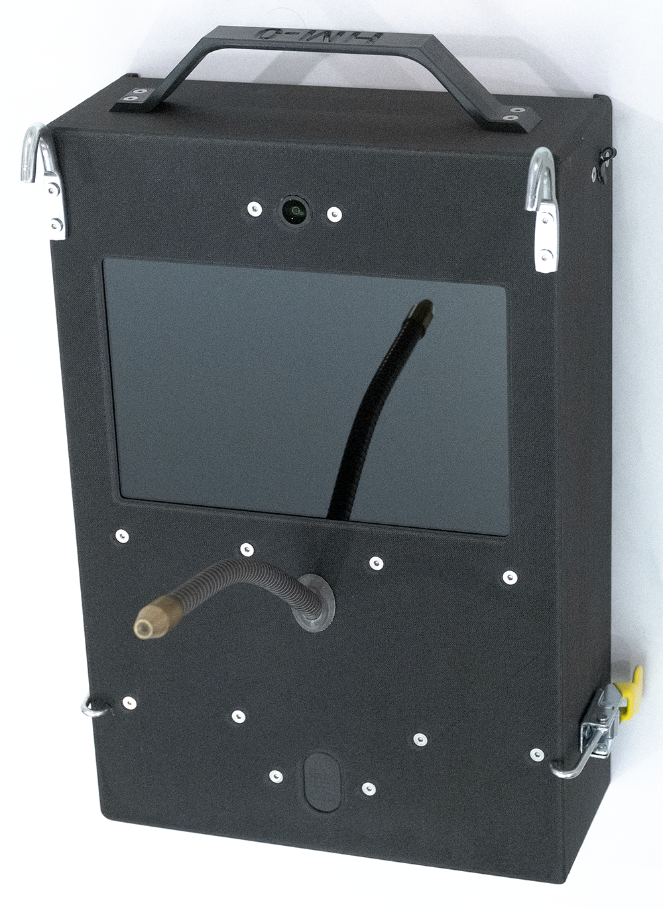

# Trainer user documentation

End-user guides for the behavioral training device: hardware overview, daily operation, Juicer maintenance and calibration, cage mounting, connecting through ESS Control, SSH access, editing task variants, cloud trial upload, system software updates, I/O box setup, offline mode, Wi-Fi connections, and agentic coding.

## Contents

| Topic | Description |
|--------|-------------|
| [Device overview and basic operation](docs/basic-operation.md) | Hardware layout (labeled photos), power, bottle setup, tasks, cleanup, charging. |
| [Using the Juicer](docs/juicer.md) | Buttons, replacing the juice line, calibration, flow rate. |
| [Attaching to the cage](docs/cage-mounting.md) | Requirements, hooks and clamps, mounting steps. |
| [Connecting to the device (quick test)](docs/ess-control-quick-start.md) | dserv.net, ESS Control, and a simple Search trial. |
| [SSH into a device](docs/ssh-into-device.md) | Find the IP, log in with your provisioning credentials (Windows, macOS, Linux). |
| [Enable cloud trial upload](docs/enable-cloud.md) | Upload trial data to the cloud, use the analysis site, and access data via API. |
| [Update system software](docs/update-system-software.md) | Update dserv, stim2, and dlsh from Lab Mesh. |
| [Install an I/O box](docs/install-iobox.md) | PTP grandmaster setup, adopt the box in ESS Control, save to flash. |
| [Enable offline mode](docs/enable-offline-mode.md) | Run without dserv.net registration or automatic task updates. |
| [Modifying variant options](docs/modify-variant-options.md) | Change dropdown options for a task variant in ESS Workbench. |
| [Managing Wi-Fi connections](docs/modify-wifi-connections.md) | Add or change networks with nmcli, including eduroam and campus enterprise Wi-Fi. |
| [Modifying protocols with agentic coding](docs/agentic-modify-protocols.md) | Use Cursor or VS Code over SSH to create or modify tasks in an existing system. |
| [Agent guide for systems development](docs/agentic-coding/agents.md) | Reference for creating and modifying systems, protocols, and variants. |
| [VS Code tasks for dserv/ESS](docs/agentic-coding/vscode-web.md) | Run dserv/ESS commands as VS Code tasks in a web environment. |
