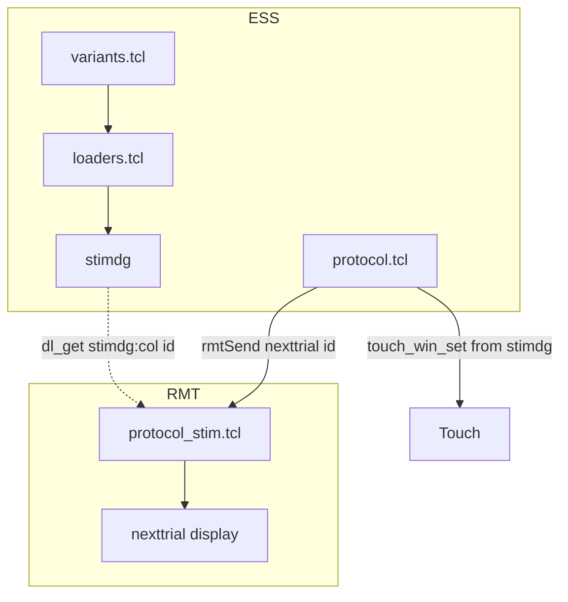
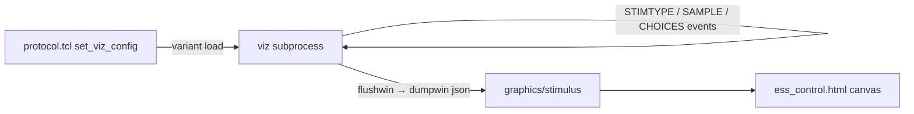

# Agent guide — dserv / ESS systems development (lab rig)

General reference for creating and modifying **systems**, **protocols**, and **variants**. Read this before editing scripts under `/home/lab/systems/` or running load commands.

---

## Preferred development method

**Build incrementally: simple first, test, add complexity, test again.** Do not implement a full protocol in one pass.

1. **Start from a working baseline** in the same system (or a sibling protocol) and confirm load + one trial works.
2. **Add one layer per iteration** — use temporary variant names (`step1`, `debug`, …) or branches while bringing up; merge into one production variant when stable.
3. **Test after every change** — load alone is insufficient; check `loading_progress`, then RMT display, then touch/reward/record path.
4. **Keep loaders minimal early** — positions and touch-related columns first; prove `*_stim.tcl` on RMT before rich stimdg payloads.
5. **Wire stimdg → display only when display works** — prefer flat columns, integer seeds, or scalars; avoid nested structures in stimdg.
6. **Add protocol extras last** — live params, `forced_side`, `mistouched`, viz, decorations, large `n_rep`.

---

## Where files live

| Path | Role |
|------|------|
| `/home/lab/systems/` | **Lab overlay** (`ESS_SYSTEM_PATH`). **Primary edit location** for systems/protocols. |
| `/home/lab/systems/ess/<system>/` | System + protocols for project `ess`. |
| `/usr/local/dserv/systems/ess/` | Base tree shipped with dserv (templates, reference implementations). |
| `/usr/local/dserv/` | Installed runtime (`config/`, `lib/`, `systems/`). |
| `/home/lab/dserv/` | Dev clone (docs, tools, source mirrors). |
| `/usr/local/dserv/config/essctrl.tcl` | Main→ESS IPC; `ess::load_system` uses `send ess evalNoReply`. |
| `/usr/local/dserv/lib/ess-2.0.tm` | `load_system`, loading progress, system lifecycle. |
| `/usr/local/dserv/lib/ess_paths-1.0.tm` | Overlay vs base path resolution. |
| `/usr/local/dserv/local/pre-systemdir.tcl` | Machine-local env (e.g. `ESS_SYSTEM_PATH`). |
| `/home/lab/dserv/local/pre-systemdir.tcl.EXAMPLE` | Example overlay setup. |
| `/usr/local/stim2/` | Stim / RMT server and examples. |
| `/usr/local/dlsh/` | `dlsh`, stimdg, `dl_*` vector ops. |
| `/usr/data/essdat/` | ESS data directory (`ESS_DATA_DIR`). |
| `/home/lab/systems/.sync_displaced/` | Backups of local files overwritten by registry sync (see below). |

**Overlay rule:** same relative path under `/home/lab/systems/` overrides `/usr/local/dserv/systems/`.

**Cursor workspace** is often `/usr/local/dserv`; **your changes** go under `/home/lab/systems/`.

### Registry sync and displaced local edits

When coding with Cursor, **edit the regular paths** under `/home/lab/systems/ess/...` — do not require per-user overlay setup for normal agent sessions.

**Why edits can disappear:** On dserv restart (or `dservctl sync`), the central registry pulls canonical scripts into the lab base tree (`$ESS_SYSTEM_PATH/ess/...`). If a local file differs from the registry copy, sync **backs up your version, then overwrites base**. This is expected — not a Cursor bug and not data loss if you know where the backup went.

**Where backups live:** `/home/lab/systems/.sync_displaced/`

Each displaced file has a sibling `.meta` file with the original path:

```
20260610_142634_ess_match_to_sample_fractal_fractal_loaders.tcl
20260610_142634_ess_match_to_sample_fractal_fractal_loaders.tcl.meta
```

The `.meta` file records `original_path` and `relpath`. Use the newest timestamp when multiple backups exist for the same file.

**Recovery workflow:**

1. Notice missing changes after restart or sync (file reverted, feature gone).
2. List backups: `ls -lt /home/lab/systems/.sync_displaced/`
3. Read `.meta` to confirm `original_path`.
4. Copy the backup back: `cp .sync_displaced/<timestamp>_ess_..._fractal_loaders.tcl <original_path>`
5. Reload: `timeout 30 essctrl -c "ess::load_system <system> <protocol> <variant>"`
6. Verify: `timeout 5 essctrl -c 'return [dservGet ess/loading_progress]'` → stage `"complete"`.

**Workbench warning:** ESS Workbench may show a displaced-files banner after sync. ESS Control does not — check `.sync_displaced/` manually if edits vanish.

**Making changes permanent:** Promote/push to the registry when the lab copy should become canonical, so future syncs pull your version instead of overwriting it.

**Per-user overlay (optional, not default for Cursor):** ESS Workbench can set `ess::set_overlay_user <name>` so edits go to `/home/lab/systems/overlays/<user>/ess/...` and survive registry sync. ESS Control has no overlay user UI; this is optional and not required for agent development.

---

## Layout: system → protocol → variant

### System (`ess/<system>/<system>.tcl`)

- State machine (states, transitions, timing params).
- Shared variables, `start`/`reset`/`quit`, trial flow hooks.
- Calls into protocol methods (`nexttrial`, `sample_on`, `responded`, …).

### Protocol (`ess/<system>/<protocol>/`)

| File | Runs on | Purpose |
|------|---------|---------|
| `<protocol>.tcl` | ESS | Protocol init, touch regions, `rmtSend`, reward, optional `set_viz_config`. |
| `<protocol>_loaders.tcl` | ESS (loader callback) | `loaders_init` → `add_loader` procs that build **stimdg**. |
| `<protocol>_stim.tcl` | **RMT** (uploaded) | `nexttrial`, `sample_on`/`off`, `choices_on`/`off`, drawing code. |
| `<protocol>_variants.tcl` | ESS | Variant dict: `loader_proc`, `loader_options`. |

```
ess/<system>/
  <system>.tcl
  <protocol>/
    <protocol>.tcl
    <protocol>_loaders.tcl
    <protocol>_stim.tcl
    <protocol>_variants.tcl
```

**Good references:** `search`, `match_to_sample/colormatch`, `match_to_sample/images`, `shapematch` under  
`/usr/local/dserv/systems/ess/` and `/home/lab/systems/ess/`.

### Variant (`<protocol>_variants.tcl`)

Each variant names a **loader proc** and **loader_options** (GUI-editable parameters passed into the loader):

```tcl
myvariant {
    description "short label"
    loader_proc setup_trials
    loader_options {
        n_rep { 16 32 50 }
        reward_rule { match nonmatch }
        # custom_option { value_a value_b }
    }
}
```

- Options become **arguments** to the loader body (must be listed in `add_loader setup_trials { n_rep reward_rule … }`).
- Use `dl_set $g:column_name …` to add stimdg columns consumed by protocol or stim.
- First value in a `{ … }` list is typically the default in the ESS UI.

---

## Choosing where to make the change

Within an existing **system**, most task changes fall into one of three levels. Pick the **smallest** level that fits — less surface area means fewer files to touch and easier testing.

| Level | When to use it | Typical files |
|-------|----------------|---------------|
| **Loader option** (edit an existing variant) | The change is a user-selectable parameter (dropdown value, numeric range, on/off toggle). An existing `loader_proc` can branch on the new value without a different trial structure. | `<protocol>_variants.tcl`, `<protocol>_loaders.tcl`; sometimes `<protocol>_stim.tcl` or `<protocol>.tcl` to read the value at trial time. See [Adding a loader option](#adding-a-loader-option-pattern). |
| **New variant** (same protocol) | Trial generation differs — different defaults, a different `loader_proc`, or a distinct preset you want to keep separate from existing variants — but stimulus drawing, touch wiring, reward flow, and viz architecture stay the same as sibling variants in that protocol. | Primarily `<protocol>_variants.tcl`; add or extend `add_loader` procs in `<protocol>_loaders.tcl` if needed. Use temporary names (`step1`, `debug`, …) while bringing up; merge when stable. |
| **New protocol** (same system) | Stimulus type, trial phases, touch/response wiring, or preview (viz) architecture differ materially from existing protocols. Copy a sibling protocol folder and adapt. | Full `<protocol>/` directory: `<protocol>.tcl`, `*_loaders.tcl`, `*_stim.tcl`, `*_variants.tcl`. See [Checklist: new or modified protocol](#checklist-new-or-modified-protocol). |

**Rules of thumb:**

1. **Start with “can this be a dropdown?”** If yes, it is almost always a loader option on an existing variant — not a new variant or protocol.
2. **Same drawing and trial flow, different trial table?** New variant (or extend an existing loader). Example: another `n_rep` / `reward_rule` preset, or a loader that builds a different stimdg layout while reusing the same `*_stim.tcl`.
3. **Different drawing pipeline or response model?** New protocol under the same system. Example: `match_to_sample/colormatch` (colored squares), `match_to_sample/fractal` (vector fractals), and `match_to_sample/images` (PNG pool) are three protocols — not three variants of one protocol.
4. **Cross-protocol reference is normal.** A feature in protocol A can copy a pattern from protocol B in the same system (e.g. distractor opacity in `colormatch` applied to `fractal`). That does not mean they should be merged into one protocol.
5. **New system** (e.g. building Search or Match-to-sample from scratch) is out of scope for incremental edits — copy an entire system template and follow the full protocol checklist.

**Decision questions** (good for Ask mode before planning):

- What should the experimenter select in ESS Control — a new dropdown value, a new variant name, or a new protocol name?
- Does an existing `loader_proc` already build the right stimdg shape, or do you need a new one?
- Can existing `*_stim.tcl` draw the result, or does RMT drawing / touch / viz need to change?
- Which existing protocol or variant is the closest match to copy from?

---

## Data flow



- **Loader** builds stimdg on ESS at load/variant time.
- **Protocol** reads stimdg for touch windows, reward rules, trial selection; sends commands to RMT.
- **Stim** reads stimdg on RMT inside `nexttrial` (and related procs) for geometry and appearance.

---

## Pitfalls (any protocol)

### Load / essctrl

- Use **`essctrl -c "ess::load_system <system> <protocol> <variant>"`** (main / port 4620).
- **Instant return ≠ success** — check `dservGet ess/loading_progress` for `"stage":"complete"`.
- Avoid **`essctrl -s dserv`** when the dserv channel is wedged (even `return 1` may hang); restart dserv if needed.
- **`essctrl -s ess`** is poor for verification; use **`send ess {…}`** from main for ESS state and errors.

### Loaders

- Loader bodies are **`oo::Obj` methods** — they do **not** resolve bare namespace procs; call helpers as **`::ess::<system>::<protocol>::helper`** (see [Loader helpers](#loader-helpers-need-fully-qualified-names)).
- **Keep trial setup inline** inside each `add_loader { … }` block (see colormatch), or duplicate small blocks.
- Stall at ~60% `variant_execution` often means **`invalid command name`** inside the loader — common causes: wrong helper prefix (`::match_to_sample::` vs `::ess::match_to_sample::`), or a nonexistent **`dl_*`** name (e.g. **`dl_ge`** — use **`dl_gte`**; see [dl comparisons](#dl-comparisons)).

### stimdg

- **Avoid nested columns** (lists of lists, heavy `dl_slist` of serialized Tcl) — can hang load or sync.
- Prefer **scalars, vectors, integer seeds**, and simple strings per row.
- Column names in stimdg must match what **stim** and **protocol** read (`dl_get stimdg:column $id`).
- **Scratch data** (path lists, index pools) belongs in **`dl_local`**, not throwaway stimdg columns — do not `dg_delete $g:temp_col` on a column you only needed for `dl_choose`; that errors at load time.

### Stim vs protocol

- **RMT** runs `*_stim.tcl` — real graphics live here.
- **Viz** (`set_viz_config` in `*_stim.tcl` or protocol) is optional and may show simplified placeholders.
- stimdg color/position columns used for **touch** may differ from what stim draws; document the split if intentional.

---

## essctrl quick reference

| Service | Port | Notes |
|---------|------|--------|
| main (default) | 4620 | Load, `dservGet`, `send ess` |
| ess | 2560 | Raw ESS Tcl; not primary for load checks |
| stim | 4612 | Stim/RMT |

```bash
# Load
timeout 30 essctrl -c "ess::load_system <system> <protocol> <variant>"

# Verify (required)
timeout 5 essctrl -c 'return [dservGet ess/loading_progress]'
timeout 5 essctrl -c 'send ess {return [namespace eval ::ess {array get current}]}'

# Debug failed load on ESS
timeout 60 essctrl -c 'send ess {set e [catch {::ess::load_system <system> <protocol> <variant>} msg]; list catch=$e msg=$msg ei=$::errorInfo}'

# Known-good sanity check
timeout 30 essctrl -c "ess::load_system search"
```

**essctrl** is the older main-interpreter wrapper; **`dservctl`** is the preferred CLI for datapoints, subprocess targets, and streaming. Use whichever is already in a script, but prefer `dservctl` for new automation.

---

## dservctl CLI

Run **`dservctl --help`** for the full command list and global flags. Subcommands also accept **`dservctl <command> --help`** where implemented.

| Task | Example |
|------|---------|
| Main Tcl (same as `essctrl -c`) | `dservctl -c 'return [dservGet ess/status]'` |
| ESS subprocess | `dservctl ess 'return [::ess::system_version]'` |
| Stimulus storage (R2 sync) | `dservctl stimulusstorage 'put <slug>'` · `'get <slug>'` |
| Trial sync | `dservctl trialsync 'return ok'` |
| Read / write dpoints | `dservctl get ess/action_state` · `dservctl set …` · `dservctl touch …` |
| Stream updates | `dservctl --json listen eventlog/events ess/trialinfo` |
| dlsh / dg reference (offline) | `dservctl docs show dl_urand` |
| REPL | `dservctl shell` · `dservctl shell -s ess` |
| Registry / scripts | `dservctl sync …` · `dservctl script get …` |

**Global flags** (must appear **before** the subcommand): `-H/--host`, `--json`, `--verbose`, `-w/--workgroup`, etc. Example: `dservctl --json listen "ess/*"` — not `dservctl listen --json`.

**JSON listen** registers a local TCP callback; each matching update is one JSON line on stdout. Use for agents, logging, or correlating trial-side effects with datapoints like `ess/trialinfo`.

```bash
# Terminal 1: stream events + trial records
dservctl --json listen eventlog/events ess/trialinfo

# Terminal 2: drive ESS (see next section)
dservctl -c 'ess::start'
```

Other high-value commands: `dservctl status`, `dservctl logs`, `dservctl service …`, `dservctl getkeys ess/*`.

**Restart dserv and wait before probing subprocesses.** Child subprocesses `source` their config after the main process starts. If you check too soon, `send` / `dservctl <subprocess>` can fail with `server "…" not found` even when `systemctl` reports active.

```bash
sudo systemctl restart dserv && sleep 5
timeout 5 dservctl stimulusstorage 'return ok'   # must return ok, not "server not found"
timeout 5 dservctl trialsync 'return ok'
```

After editing any `/usr/local/dserv/config/*conf.tcl` loaded by a subprocess, restart dserv (subprocesses do not hot-reload).

---

## Dserv Tcl config subprocesses

Several services in `/usr/local/dserv/config/dsconf.tcl` are separate Tcl interpreters started with `subprocess <name> "source …"`. They use `errormon enable`; failures appear on the main dserv journal as **`!TCL_ERROR …`** (sometimes two messages concatenated in one line).

### Subprocess failed to start?

| Symptom | Likely cause |
|--------|----------------|
| `send: server "stimulusstorage" not found` | Subprocess never registered — often **`source` failed** at boot |
| `!TCL_ERROR …` right after `initializing dataserver` in logs | Error while sourcing a subprocess script, not necessarily during a later command |
| `dservctl <name> 'return ok'` returns `ok` | Subprocess loaded; further errors are **runtime** |

```bash
dservctl logs | tail -30
# or: journalctl -u dserv --since "5 min ago"

# Test whether a config file sources cleanly (before debugging put/get):
timeout 5 dservctl -c 'catch {source /usr/local/dserv/config/stimulusstorageconf.tcl} e; list e=$e'
```

If `source` fails, bisect with `head -N …/stimulusstorageconf.tcl` and partial `source` to find the failing line. Trust `wc -l` on the Pi if the IDE line count looks stale.

### Tcl proc brace pitfall (config `*.tcl`)

In long `proc` bodies, a **nested `} elseif {` inside another `if`** can make Tcl close the proc body early when the file is `source`d. Code after that `}` then runs at **top level on load**, which produces misleading errors:

- `can't read "someVar": no such variable` — variable was only set inside the truncated proc
- `expected integer but got a list` — later fragments (e.g. yajltcl `$enc integer`) run with unset or wrong arguments

Prefer `} else { if { … } }` over deep `} elseif {` nesting inside proc bodies in dserv config scripts. Initialize locals (`set var ""`) before any `if {$var …}` in the same proc.

### yajltcl integers

For `$enc integer $value`, the value must be a **scalar** integer. Opaque `expected integer but got a list` often means argument shuffle or top-level execution from a brace bug — not “file too large.” Coerce with `entier` / `[string is integer -strict]` before `$enc integer` (see `trialsync::_emit_json_scalar` in `/usr/local/dserv/config/trialsyncconf.tcl`).

### stimulusstorage (R2 image sync)

| Item | Detail |
|------|--------|
| Config | `/usr/local/dserv/config/stimulusstorageconf.tcl` |
| Started from | `subprocess stimulusstorage` in `dsconf.tcl` |
| CLI | `dservctl stimulusstorage 'put <slug>'` · `'get <slug>'` |
| Main IPC | `send stimulusstorage {put match_to_sample/images/natural_images7}` |
| Env | `ESS_WORKGROUP`, `ESS_STIMULUS_DIR` (`local/pre-systemdir.tcl`), ingest secret `/etc/dserv/trial_ingest_secret` (same as trialsync) |
| Dpoint | `configs/ess_stimulus_storage_url` (`local/pre-remoteservers.tcl`) |
| Local layout | `$ESS_STIMULUS_DIR/<slug>/` catalog names + `_store/<hash><ext>` canonical bytes |

Sync **put** (typical): omit the local path — uses `$ESS_STIMULUS_DIR/<experiment_slug>/`.

```bash
timeout 30 dservctl stimulusstorage 'put match_to_sample/images/natural_images7'
timeout 60 dservctl stimulusstorage 'get match_to_sample/images/natural_images7'

# Full trace from main:
timeout 30 dservctl -c 'send stimulusstorage {set e [catch {put match_to_sample/images/natural_images7} msg]; list catch=$e msg=$msg ei=$::errorInfo}'
```

Peer: **trialsync** — `dservctl trialsync 'return ok'`, config `trialsyncconf.tcl`.

---

## Simulating trials and listening for events

Use this pattern to **run trials without touch/hardware**, and to **observe ESS behavior** (state machine, `.ess` event log, datapoints). Load verification alone is not enough.

### Prerequisites

1. Load system/protocol/variant; confirm `loading_progress` is `"complete"`.
2. Optional clean run: `ess::stop` → `ess::reset` → `ess::start` (via `dservctl -c` or `essctrl -c`).
3. Start a **listener** in another terminal before driving trials (see below).

### Know which “state” you are polling

| What you read | Meaning |
|---------------|---------|
| `dservGet ess/status` | Coarse GUI state: `Running` / `Stopped` / `Inactive` — **not** the trial state machine |
| `send ess {set s $::ess::current(state_system); return [$s status]}` | `running` or `stopped` on the system object — still **not** the current trial phase |
| **`dservGet ess/action_state`** | **Use this** — current phase, e.g. `sample_on_a`, `wait_for_response_a`, `inter_obs_a` (only published while the system is **running**; absent when stopped) |

Poll `ess/action_state` until it ends with `_a` for the phase you need (action phase). For a button response, wait for **`wait_for_response_a`** before simulating input. If `dservctl get ess/action_state` returns “not found”, call **`ess::start`** first.

```bash
timeout 3 dservctl get ess/action_state
```

### Simulate button responses

Protocols with `use_buttons` and `::ess::button_init` accept **`::ess::button_simulate <channel> <0|1>`** (press / release). Only valid during **`wait_for_response`** — simulating during sample, delay, or letgo gating tends to **`ENDTRIAL` ABORT** and incomplete trial records.

```bash
# After action_state is wait_for_response_a:
timeout 5 dservctl -c 'send ess {::ess::button_simulate 0 1}'
timeout 5 dservctl -c 'send ess {::ess::button_simulate 0 0}'
```

Wait for pre-sample + sample + delay to finish after `ess::start` (protocol-dependent; match_to_sample defaults are often several seconds unless params are shortened).

**Choosing left vs right channel:** read protocol variables on the system object, then map to match/nonmatch (example for two-choice MTS with `targ_x` / `dist_x`):

```bash
timeout 5 dservctl -c 'send ess {set s $::ess::current(state_system); list [$s get_variable reward_rule] [$s get_variable targ_x] [$s get_variable dist_x]}'
```

Between trials, wait until `ess/action_state` is `inter_obs_a` (or the next trial’s `wait_for_response_a`) before pressing again.

### Listen for events and trial datapoints

ESS logs trial events to the open `.ess` file and mirrors them on **`eventlog/events`**. Per-trial summaries are published on **`ess/trialinfo`** (JSON) at end of trial.

```bash
dservctl --json listen eventlog/events ess/trialinfo
```

**`eventlog/events`** (dtype event): fields include `e_type`, `e_subtype`, `e_params`, `timestamp`. Name lookup tables: `ess/evt_type_ids`, `ess/evt_subtype_ids` (or `dservctl get` them once). Common types include `ENDTRIAL`, `REWARD`, `RESP`, `SAMPLE`, `CHOICES` — see `/usr/local/dserv/lib/ess-2.0.tm` `_evt_info` or the event viewer (`www/event_viewer.html`).

**`ess/trialinfo`**: JSON with `trialid`, `status`, `rt`, `stiminfo`, etc. `status` is the trial outcome the protocol passed to `save_trial_info` (e.g. correct/incorrect); incomplete or aborted runs may show other values.

Sort by `timestamp` (microseconds) to see ordering between streams. Other useful matches: `ess/action_state`, `ess/obs_id`, `stimdg`, `graphics/stimulus`.

**GUI alternatives:** `www/event_viewer.html`, `scripts/tcl/eventtrace.tcl` (qpcs + Tk), essgui event table — same `eventlog/events` source.

### Minimal end-to-end loop (two terminals)

```bash
# Terminal 1
dservctl --json listen eventlog/events ess/trialinfo ess/action_state

# Terminal 2 — after load
dservctl -c 'catch {ess::stop} e; catch {ess::reset} e; ess::start'
# Poll until wait_for_response_a, then button_simulate press/release
# Repeat for more trials; watch Terminal 1 for event ordering and trialinfo
```

### Common pitfalls

- **`ess::start` fails** if already running — stop/reset first, or only simulate when the machine is in the response window.
- **Wrong phase** — pressing early produces `ENDTRIAL` ABORT and no normal trial completion.
- **Tcl one-liners** — avoid `catch {dservGet ess/status} x; $x` when the value can be `stopped` (Tcl may treat it as a command). Use `return [dservGet ess/status]` or separate commands.
- **Listener flag order** — `dservctl --json listen …`, not `dservctl listen --json …`.

### RMT / stim without a full trial

After load, stim procs can be smoke-tested on the stim service (port 4612) without starting ESS:

```bash
timeout 5 essctrl -s stim -c 'nexttrial 0'
timeout 5 essctrl -s stim -c 'sample_on; choices_on'
```

Touch/reward paths are not exercised this way; use the listen + simulate loop above for integrated trials.

---

## RMT / stimuli

- `configure_stim $rmt_host` in protocol init uploads `<protocol>_stim.tcl`.
- `rmtSend "nexttrial $stimtype $sample_stays_on"` → `nexttrial` on RMT.
- `rmtSend !sample_on` invokes the `sample_on` proc on RMT.
- Stim service must be running to **see** stimuli; load can still succeed without RMT.

---

## Checklist: new or modified protocol

Use this when the [Choosing where to make the change](#choosing-where-to-make-the-change) table points to **new protocol** — stimulus type, trial flow, or viz architecture differs from siblings in the same system.

1. Copy structure from a working protocol in the same system.
2. Edit under `/home/lab/systems/ess/<system>/<protocol>/`.
3. Confirm `ESS_SYSTEM_PATH` points at `/home/lab/systems` (`pre-systemdir.tcl`).
4. Add **`loader_options`** + matching **`add_loader` argument list** + stimdg columns.
5. Implement **`nexttrial`** in `*_stim.tcl`; read stimdg with `dl_exists` / `dl_get`.
6. Wire **touch** in `*_stim.tcl` / protocol from stimdg positions (and radii).
7. Load with timeout; confirm **100%** `loading_progress`.
8. Run one trial on hardware: RMT display, touch or buttons, reward.
9. Consolidate debug variants into one production variant when done.

---

## Adding a loader option (pattern)

Use this when the [Choosing where to make the change](#choosing-where-to-make-the-change) table points to **loader option** — the smallest change level.

1. **`_variants.tcl`** — add to `loader_options { my_option { a b } }`.
2. **`_loaders.tcl`** — add `my_option` to the `add_loader` braced arg list; use `$my_option` in the body; expose per-trial data via `dl_set $g:my_column …` if stim/protocol need it.
3. **`_stim.tcl` or `_protocol.tcl`** — read with `dl_get stimdg:my_column $id` when the trial runs.

Use a **new stimdg column name** if the option affects RMT display; do not overload unrelated columns (e.g. viz colors vs RMT colors).

---

## dlsh, dl_*, and dg_*

Custom Tcl packages used for experiments live in **`/usr/local/dlsh/dlsh.zip`**. Test with **`tclsh9.0`** by mounting the zip as a VFS with **zipfs** — **do not unzip** the archive.

### Prefer `dl_*` and `dg_*` over plain Tcl

The **`dl_*`** (dynamic lists) and **`dg_*`** (dynamic groups) libraries are the primary data tools for experiment code. They are **vectorized, typed, and memory-efficient** — prefer them whenever you would otherwise reach for Tcl **arrays**, **`foreach`/`lappend` loops**, or **lists of lists**.

| Need | Prefer | Avoid |
|------|--------|-------|
| Per-trial numeric column (positions, hues, seeds) | `dl_irand`, `dl_urand`, `dl_series`, `dl_repeat` + `dl_set $g:col …` | Loop + `lappend` into a Tcl list |
| Element-wise math on a column | `dl_add`, `dl_mult`, `dl_mod`, `dl_choose` | Manual index loop |
| Multiple aligned columns | `dl_llist` + `dl_transpose` | Parallel Tcl lists kept in sync by hand |
| Tabular trial table (stimdg) | `dg_create stimdg` + named columns via `dl_set $g:name …` | Dict of arrays or nested Tcl lists |
| Temporary scratch vectors | `dl_local` | `set` on Tcl lists you forget to clean up |
| Per-element compare (`>=`, `>`, `==`) | `dl_gte`, `dl_gt`, `dl_eq`, `dl_lt`, `dl_not` | `dl_ge` (does not exist) |
| Read on RMT / debug print | `dl_get stimdg:col $id`, `dl_tcllist` | Passing raw nested Tcl through stimdg |

### dl comparisons

There is **no** `dl_ge`. Use **`dl_gte`** for element-wise `>=`. Before guessing a signature: `dservctl docs show dl_gte` (requires `sqlite3` on PATH for the local docs DB).

| Intent | Command |
|--------|---------|
| `a >= b` | `dl_gte` |
| `a > b` | `dl_gt` |
| `a == b` | `dl_eq` |
| `a < b` | `dl_lt` |
| logical not | `dl_not` |

**Mental model:** a **dyngroup** (`dg_*`) is a **table** — `stimdg` is one, with one row per trial and named columns. **`dl_*`** ops build and transform **columns** (vectors) before attaching them with `dl_set $g:column_name $vector`.

**Do not revert to plain Tcl** for trial setup because it looks simpler in a small prototype — the `dl_*` catalog (204 commands) covers sorting, reshaping, random fills, histograms, cross-products, and matrix-style ops that become painful in raw Tcl as `n_rep` grows.

**Stimdg export caveat (unchanged):** build richly with `dl_*`/`dg_*`, but columns consumed by RMT sync should stay **flat** — scalars, vectors, integer seeds, simple strings per row. Avoid nesting heavy Tcl structures inside stimdg cells; use `dl_zip` / layer columns intentionally (see `dl_zip` docs) rather than ad-hoc lists-of-lists.

### Per-trial nested slots (multiple items per trial)

When each trial holds **N items** (timed sequence steps, pulse trains, etc.), treat stimdg as **one row per trial**, each cell holding a **Tcl list of N slots** — not N extra stimdg rows.

**Loader: building the per-trial array**

| Pitfall | What goes wrong | Fix |
|---------|-----------------|-----|
| `lappend row $item` when `$item` is a list | Tcl **splices** list elements into `row` (e.g. three layer dicts become three row entries, not one slot) | `lappend row [list $item]` — one slot per item |
| `dl_append $g:col $row` | `dl_append` **flattens** a bare Tcl list into multiple rows | Wrap the trial cell: `dl_append $g:col [list $row]` or `dl_append $g:col [dl_ilist {*}$row]` for flat scalars (seeds, indices) |
| `dl_ilist {*}$row` on nested dicts / fparams | `dl_llist` cannot hold arbitrary nested dict trees — loader errors at `variant_execution` | Store nested geometry in **`dg_addNewList $g col string`** + `dl_append $g:col [list $row]`; keep `dl_ilist` for simple per-slot data (integer seeds, floats) |
| Reading slot `k` with `dl_get stimdg:col:$trial $k` on a **string** column | Often fails (`dl_find` / index out of range) depending on column type | Read the **whole trial cell**, unwrap one trial envelope, then index: `set val [dl_get stimdg:col $trial]` → `dl_tcllist` if `%list*` → if `llength == 1` use `[lindex $val 0]` as the N-slot list → `[lindex $val $k]` |

**RMT / viz: one extra wrap** — loader `[list $row]` plus dl string round-trip can leave `{ {slot0} {slot1} … }` as `{ {{layers…}} }`. If `llength` of a slot’s fparams is 1 but `[lindex $fp 0]` has the real layer count, unwrap one level before `dict with` / drawing.

**Do not** put per-element onsets in the same flattened column as fparams — use `dl_replicate [dl_llist $base_onsets] $n_obs` (see `sequence` / `mp_pulsed`) so timing stays a proper nested dl column with `dl_get stimdg:element_onsets:$trial $k`.

### Colors tied to precomputed items

If shape/texture is **seeded at load** (`srand` + Tcl `rand()` in the loader), preview and RMT must read the **same** precomputed colors from stimdg — not a second random pass.

| Pitfall | Fix |
|---------|-----|
| `set_layer_rgb` (vectorized `dl_urand`) on choice columns while sequence slots use `make_*_seeded` | One source of truth: per trial, `dl_append $g:left_colors [list [make_layer_rgb_seeded $left_seed $nlayers]]` (and same for right / each sequence slot). Drop `set_layer_rgb` for those columns. |
| Colors stored with `lappend row_colors $colors` when `$colors` is a list of RGB triplets | Same splice bug as fparams — use `lappend row_colors [list $colors]` |
| Comparing preview to “correct” choice | Cache colors from the **same seed** as the target item (e.g. first slot seed = correct fractal seed on that side). |

**Rule:** pick **seed → fparams + colors** once in the loader; stim and viz only **parse and draw** stimdg — never regenerate from seed on the RMT or viz side unless both sides share one proc and you accept drift risk.

**Reference protocols using both:** `fractal`, `mp_pulsed`, `colormatch` loaders — all create `stimdg` via `dg_create` and populate columns with `dl_*`.

### Setup script

Canonical helper: `/usr/local/dserv/scripts/tcl/dlsh-setup.tcl`

```tcl
# dlsh-setup.tcl - Source this at top of scripts
proc dlsh_setup {{zipfile /usr/local/dlsh/dlsh.zip}} {
    set base [file join [zipfs root] dlsh]

    # Check if already mounted
    if {$base in [zipfs list]} {
        return ;# Already mounted
    }

    if {![file exists $zipfile]} {
        error "dlsh.zip not found at $zipfile"
    }

    zipfs mount $zipfile $base
    set ::auto_path [linsert $::auto_path 0 $base/lib]
}

# Auto-setup if called directly
if {[info exists ::argv0] && [file tail $::argv0] eq "dlsh-setup.tcl"} {
    dlsh_setup
}
```

### Usage in test scripts

At the top of any standalone `tclsh9.0` test script:

```tcl
source [file join [file dirname [info script]] dlsh-setup.tcl]
dlsh_setup
package require dlsh
# package require your_custom_package   ;# from //zipfs:/dlsh/lib/
```

Or run setup only (auto-mounts):

```bash
tclsh9.0 /usr/local/dserv/scripts/tcl/dlsh-setup.tcl
```

Example test script: `/usr/local/dserv/scripts/tcl/test_dlsh_example.tcl`

```bash
tclsh9.0 /usr/local/dserv/scripts/tcl/test_dlsh_example.tcl
```

After mount, packages are under `//zipfs:/dlsh/lib/` (e.g. `grasp`, `qpcs`, `stimcompose`, and other experiment libs). dserv itself mounts the same zip at startup in `config/dsconf.tcl` (same pattern: `zipfs mount` + `auto_path`).

### Building complex lists (`dl_*`)

Use **`dl_local`** for temporary dlsh lists (auto cleanup) — prefer it over `set` for lists you do not need to keep. Use **`dl_tcllist`** to convert a dlsh list to a Tcl list for `puts`, `lindex`, etc.

**Example** (element-wise add on random integers):

```tcl
dl_local ns [dl_add 2 [dl_irand 10 3]]
puts [dl_tcllist $ns]
```

- `dl_irand count max` — `count` random integers in **0 .. max−1** (upper bound exclusive)
- `dl_add`, `dl_mult`, `dl_mod` — element-wise on lists
- `dl_repeat value count` — broadcast a scalar
- `dl_llist col1 col2 …` — multiple columns (length = number of columns)
- `dl_set $g:column_name $list` — stimdg columns in loaders (see experiment `*_loaders.tcl`)

**Experiment-style pattern** (correlated columns, as in colormatch):

```tcl
dl_local hues [dl_irand $n_obs 360]
dl_local match_hues [dl_mod [dl_add 180 $hues] 360]
dl_local color_cols [dl_llist $hues $match_hues]
```

**RGB columns** (`dl_llist` + `dl_transpose`):

```tcl
# ns may be a dlsh list variable (e.g. per-trial metadata), not only a scalar count
dl_local ns [dl_add 2 [dl_irand 10 3]]

dl_local rs [dl_urand $ns]
dl_local gs [dl_urand $ns]
dl_local bs [dl_urand $ns]

dl_local rgbs [dl_transpose [dl_llist $rs $gs $bs]]
```

- `dl_llist $rs $gs $bs` — three channels as **columns** (length 3).
- `dl_transpose` — one **row per trial** (length = number of observations).
- **`dl_urand` and scalar vs list:** with a **scalar** count (`dl_urand $n_obs`), you get one uniform random float per trial (flat length-`$n_obs` vectors). With a **list** argument (`dl_urand $ns` when `ns` is a dlsh list), each element of `ns` is its own draw count — rows vary in size (e.g. `ns` value 2 → 2 floats, 3 → 3 floats). That is useful only if you intend variable-length random blocks per trial.
- For **one RGB triple per trial**, keep trial count separate from metadata:

```tcl
set n_obs 10
dl_local ns [dl_add 2 [dl_irand $n_obs 3]]   ;# per-trial metadata, length n_obs
dl_local rs [dl_urand $n_obs]
dl_local gs [dl_urand $n_obs]
dl_local bs [dl_urand $n_obs]
dl_local rgbs [dl_transpose [dl_llist $rs $gs $bs]]
```

Reference implementations: `/usr/local/dserv/systems/ess/` and `/home/lab/systems/ess/` (`*_loaders.tcl`, protocol `.tcl` files with `dl_local` / `dl_set`).

**Fractal layer RGB (fixed `nlayers` per load):** one stimdg column per role (`sample_layer_rgb`, `match_layer_rgb`, `nonmatch_layer_rgb`). Per layer `L`, bake `dl_transpose [dl_llist [dl_float $rs] [dl_float $gs] [dl_float $bs]]`, collect layer columns, then `dl_set $g:sample_layer_rgb [dl_transpose [dl_llist {*}$layerCols]]` so each trial row is a list-of-lists of RGB triples. RMT: `dl_tcllist` from `dl_get stimdg:sample_layer_rgb $id`. No `sample_color` / Lab viz columns — viz uses neutral squares; color seeds stay `dl_local` in the loader only. Use `dl_float` on Tcl channel lists — not bare `dl_slist $flatList`.

### Command reference lookup (`dservctl docs`)

Local SQLite command reference — **no running dserv required**. DB: `/usr/local/dserv/db/docs.db` (override with `$DSERV_DOCS_DB`).

```bash
# Full entry: syntax, params, examples, hints
dservctl docs show dl_urand
dservctl docs show dl_zip
dservctl docs show dg_create

# Search (single terms work best; multi-word = exact phrase)
dservctl docs search "random"
dservctl docs search "zip" --namespace dl

# Browse namespaces
dservctl docs list --namespace dl    # 204 dl_* commands
dservctl docs list --namespace dg    # 28 dg_* commands
dservctl docs namespaces

# JSON for scripting
dservctl docs show dl_urand --json
```

**Before guessing a signature:** run `dservctl docs show <command>`. High-value lookups for loaders: `dl_urand`, `dl_llist`, `dl_transpose`, `dl_zip`, `dl_set`, `dg_create`, `dg_addNewList`.

**Search tip:** `"random shape"` often returns nothing (phrase match). Search one term at a time, or `show dl_zip` for same-shape / RGB tuple examples.

---

## Rig learnings for agents

Notes from lab bring-up that are easy to miss from code alone.

### Dserv config `proc` bodies

When editing `/usr/local/dserv/config/*.tcl` subprocess scripts, a brace mismatch can end a `proc` early so trailing lines execute at **source** time. Symptom: bizarre `!TCL_ERROR` at dserv boot and `send: server "<name>" not found`. Verify with `catch {source …}` (see **Dserv Tcl config subprocesses** above) before debugging runtime `put`/`get`.

### System version (`default-0.0.0`)

Trial records and snapshots store `"version"` from the **System** object — there is **no separate protocol version field**.

At `create_system`, ESS sets version via `::ess::version_string` in `/usr/local/dserv/lib/ess-2.0.tm`:

- If dserv dpoints **`ess/git/branch`** and **`ess/git/tag`** exist → `"$branch-$tag"` (e.g. `main-v1.0.0`).
- Otherwise → hardcoded fallback **`default-0.0.0`**.

Those dpoints are populated at dserv startup by `/usr/local/dserv/config/gitconf.tcl`, which treats **`$ESS_SYSTEM_PATH/ess`** as a git repo (`git branch --show-current`, `git describe --abbrev=0 --tags`). If that path is **not** a git checkout, the dpoints are never set and every load shows `default-0.0.0`.

**Override options** (both call `set_version` on the System object):

| Where | Scope |
|-------|--------|
| `$sys set_version 0.1.0` in `<system>.tcl` `create`, after `create_system` | All protocols in that system |
| `$s set_version 0.1.0` in `<protocol>.tcl` `protocol_init`, after `set_protocol` | Only when that protocol is loaded |

Reference: `search.tcl` uses the system-level override. Reload after changing version — it is fixed at load time.

```bash
timeout 5 essctrl -c 'send ess {return [::ess::system_version]}'
```

### Loader helpers need fully qualified names

Loader bodies are `oo::Obj` methods and **do not** resolve bare namespace procs. Define helpers in the protocol namespace, but call them from inside `add_loader { … }` with the full path:

```tcl
::ess::match_to_sample::myprotocol::my_helper $g $n_obs
```

An `invalid command name` for a helper proc you know exists usually means a missing namespace prefix — often visible as a stall at ~60% `variant_execution`.

**Source file vs runtime namespace:** `*_loaders.tcl` often declares `namespace eval match_to_sample::myprotocol { … }`, but after ESS loads the protocol, procs live under **`::ess::match_to_sample::myprotocol`**. Call **`::ess::match_to_sample::images::list_pool_pngs`**, not `::match_to_sample::images::list_pool_pngs`.

### Loader patterns (MTS / object images)

**Distinct nonmatch index** (sample and distractor must differ; vectorized):

```tcl
dl_local sample_id [dl_irand $n_obs $nPool]
dl_local nonmatch_id [dl_irand $n_obs [expr {$nPool - 1}]]
dl_local nonmatch_id [dl_where [dl_gte $nonmatch_id $sample_id] \
    [dl_add $nonmatch_id 1] $nonmatch_id]
dl_local pool_dl [dl_slist {*}$pool_paths]
dl_set $g:sample_image [dl_choose $pool_dl $sample_id]
dl_set $g:match_image $g:sample_image
dl_set $g:nonmatch_image [dl_choose $pool_dl $nonmatch_id]
```

**Balanced left/right** (colormatch / images): `dl_set $g:side [dl_shuffle [dl_repeat "0 1" [expr {$n_rep / 2}]]]` — use **even** `n_rep` so match is equally often left and right.

**Variant loader options** (`match_to_sample/images`): **`n_rep`** = number of trials (stimdg rows); **`max_pool`** = cap on distinct PNGs (`0` = all files in pool dir); **`reward_rule`** = `match` or `nonmatch`.

**Sourced helper files:** loader procs must live in **`::ess::<system>::<protocol>`**, the same namespace as `loaders_init`. If you `source` a separate `*_miya.tcl` (or similar) from inside a loader callback, a top-level `namespace eval match_to_sample::fractal { … }` in that file creates **`::match_to_sample::fractal`**, not `::ess::match_to_sample::fractal`. Define loader helpers in `*_loaders.tcl` itself, or source body-only procs from inside the loaders `namespace eval` block with no nested `namespace eval` in the sourced file.

### Reading protocol state from essctrl

Protocol methods use `$s add_variable …`; inside running methods those names work as object variables. From **`essctrl` / `dservctl` one-liners**, read them through the system object — do not assume bare `$reward_rule`-style expansion will work:

```bash
timeout 5 essctrl -c 'send ess {set s $::ess::current(state_system); list [$s get_variable cur_id] [$s get_variable reward_rule]}'
```

### Testing without full hardware

See **[Simulating trials and listening for events](#simulating-trials-and-listening-for-events)** for `dservctl listen`, `ess/action_state`, `button_simulate`, and common pitfalls.

**Load verification** (always):

```bash
timeout 5 essctrl -c 'return [dservGet ess/loading_progress]'   # stage must be "complete"
timeout 5 essctrl -c 'send ess {return [::ess::system_version]}'
```

### Stimulus Display preview (`set_viz_config`)

The **Stimulus Display** panel in `/home/lab/dserv/www/ess_control.html` mirrors trial graphics via the `graphics/stimulus` datapoint. It is **not** the RMT stream — it is a separate viz subprocess fed by `$s set_viz_config { … }` in `<protocol>.tcl`.

**Data flow:**



- At variant load, ESS publishes the viz script (`ess/viz_config`); the viz subprocess evals it in `::viz::<system>` and runs `setup` (registers event handlers, gray background).
- During **Run**, trial events update the preview: `STIMTYPE` caches stimdg columns; `SAMPLE ON` / `CHOICES ON` draw and call `flushwin`.
- `dlg_markers … fsquare` serializes as **`filledrect`** in the JSON — the web renderer already handles this (confirmed via colormatch).

**Where to edit:** protocol viz lives in **`/home/lab/systems/ess/<system>/<protocol>/<protocol>.tcl`**. If preview works for sibling protocols but not yours, fix the **`set_viz_config`** block — do not change dserv www/js or `vizconf.tcl` unless the whole panel is broken for every task.

**Reference implementation:** `match_to_sample/colormatch` — same MTS event pattern (`STIMTYPE`, `SAMPLE ON/OFF`, `CHOICES ON/OFF`) and `dlg_markers … fsquare` placeholders. Copy its viz structure before inventing a new one.

**Canonical handler pattern** (from colormatch / fractal):

```tcl
proc stimtype { type subtype data } {
    variable trial
    set trial $data
    foreach v {sample_x sample_y sample_r match_x match_y match_r} {
        variable $v [dl_get stimdg:$v $trial]
    }
}
proc sample_on { type subtype data } {
    variable trial
    variable sample_x; variable sample_y; variable sample_r
    clearwin
    dlg_markers $sample_x $sample_y fsquare -size ${sample_r}x -color $color
    flushwin
}
```

**Critical Tcl pitfall — `variable` in viz handlers:**

```tcl
# WRONG — Tcl reads this as "declare sample_x with initial value sample_y"
variable sample_x sample_y sample_r

# CORRECT — one declaration per variable (semicolon-separated)
variable sample_x; variable sample_y; variable sample_r
```

The wrong form fails at runtime with `can't read "sample_y": no such variable`. Viz event handlers error silently; `graphics/stimulus` never gets `filledrect` commands even though load and Run succeed. This bit **fractal** during bring-up; colormatch had the correct form all along.

Also avoid backslash line continuations inside `set_viz_config` braced strings — keep `dlg_markers` on one line like colormatch.

**Prefer a braced `set_viz_config` body** (like colormatch), not a double-quoted string full of `\[` escapes — those are fragile and can break viz silently. To inject a filesystem path into the braced script, use **`[string map [list @VIZ@ $viz_path] { … source @VIZ@ … }]`** (see `match_to_sample/images/images.tcl`).

**PNG viz: `STIMTYPE` before `SAMPLE ON`** — handlers cache paths/positions in `stimtype`; firing `SAMPLE ON` alone leaves variables unset and preview stays empty. Manual debug order: `STIMTYPE` (trial id) → `SAMPLE ON` → check `*drawimage*`.

**Debugging preview (compare working vs broken protocol):**

```bash
# After load + Run (or manual events below)
timeout 5 essctrl -c 'set j [dservGet graphics/stimulus]; return [string match *filledrect* $j]'

# Force viz handlers without a full trial
timeout 5 essctrl -c 'catch { dservTouch ess/viz_config }'
timeout 5 essctrl -c 'send ess { ::ess::evt_put STIMTYPE STIMID [now] 0; ::ess::evt_put SAMPLE ON [now] }'

# Viz apply errors (if any)
timeout 5 essctrl -c 'return [dservGet ess/infoLog]'
timeout 5 essctrl -c 'if {[dservExists ess/errorInfo]} { return [dservGet ess/errorInfo] } else { return ok }'
```

Expect `1` (true) from the `filledrect` check after `SAMPLE ON` when placeholders work. During Run, sample phase shows one square; choices phase shows two.

### Drawing real geometry in preview (vectors, shared `fractal` tm, custom `*_viz.tcl`)

Placeholders (`dlg_markers … fsquare`) are enough for layout; **real** preview uses the same cgraph path as MTS fractal: `fpoly` / triangle-fan decomposition via `package require fractal` or a dedicated `*_viz.tcl` that calls `fractal::draw_polys`.

**Viz subprocess is separate from ESS** — it evals `ess/viz_config` in `::viz::<system>` (`vizconf.tcl` adds `$system_path/$project/lib` to `tcl::tm::path` before eval). Common failures:

| Symptom | Cause | Fix |
|---------|-------|-----|
| Panel stays gray / empty JSON (~300–400 bytes, only `setbackground`) | Handler errored silently, or draw never ran | `dservGet ess/errorInfo`, `ess/infoLog`; fire events manually (below) |
| Placeholders worked; real draw does not | **`package require fractal` cached an old tm** without your new procs | In `setup`: `catch { package forget fractal }`, `::tcl::tm::add <path-to-lib>`, `package require fractal`. Inject lib path with `[string map [list @LIB@ $libdir] { … }]` — do not rely on a one-time top-level `package require` before `setup`. |
| `info commands fractal::my_draw` empty in viz | Wrong tm path or stale package | `dservctl viz 'return [info commands fractal::my_draw]'` after load; should list your proc |
| Events fired but no update | Wrong event names vs state machine | `sequence` uses `PATTERN ON/OFF` + `RESPWIN ON/OFF`; MTS uses `SAMPLE` / `CHOICES`. Match `evtSetScriptByName` to what the parent system `evt_put`s. |
| Draw runs on wrong phase | Cache in `stimtype`; draw on phase ON | Always handle **`STIMTYPE` before** `PATTERN ON` / `SAMPLE ON` (cache stimdg + `prepare_trial`); phase handler only draws + `flushwin`. |

**Debug checklist (vector preview):**

```bash
timeout 5 dservctl -c 'catch { dservTouch ess/viz_config }'
timeout 5 dservctl -c 'send ess { ::ess::evt_put STIMTYPE STIMID [now] 0 }'
timeout 5 dservctl -c 'send ess { ::ess::evt_put PATTERN ON [now] 0 }'   # or SAMPLE ON for MTS
timeout 5 dservctl -c 'return [string length [dservGet graphics/stimulus]]'   # expect thousands, not ~360
timeout 5 dservctl -c 'return [expr {[string first fpoly [dservGet graphics/stimulus]] >= 0}]'
```

**Shared drawing module pattern:** put parse-cache-draw procs in `systems/ess/lib/<name>-1.0.tm` or `<protocol>_viz.tcl`; viz `stimtype` calls `prepare_trial $trial`; phase ON calls `draw_*` with positions from cached `dl_get` variables. Cache **Tcl lists** (fparams, colors, paths) in namespace variables — rebuild **dl polys** on each draw (dl does not persist across viz handlers).

**`foreach` + `variable $v` in `stimtype`** — preferred over `variable x [dl_get …]` when declaring many stimdg fields (see canonical handler above).

### PNG images in preview (`dlg_image` + impro)

To show **real PNGs** (not placeholder squares) in the Stimulus Display panel, draw from the **viz subprocess** with cgraph **`dlg_image`**. The browser receives `drawimage` commands in `graphics/stimulus` JSON (handled by `GraphicsRenderer.js` in the served dserv www tree). This path is separate from RMT, which uses stim2 shaders (`shaderImageLoad`, `image.glsl`, etc. in `*_stim.tcl`).

**Per-frame draw recipe** (viz subprocess only):

```tcl
package require impro
set img [img_load /path/to/file.png]          ;# cache this handle across handlers
set w [img_width $img]
set h [img_height $img]
dl_local pix [img_imgtolist $img]             ;# RGBA bytes, depth 4
dl_local data [dl_llist [dl_ilist $w $h] $pix]
dlg_image $x $y $data $scale -center          ;# world coords + scale, like dlg_markers
flushwin
```

**What to cache (critical):**

| Cache in namespace variable | Do not cache across viz procs |
|-----------------------------|-------------------------------|
| impro handle from `img_load` | `dl_local` pixel list or `dl_llist [dl_ilist …]` from `img_imgtolist` |

dl lists built inside a proc **do not survive proc return** in the viz subprocess (same pitfall as polygon caches). Load each PNG once with `img_load`, store handles in `::viz::<system>` namespace variables (e.g. `img_backpack`), and on each `SAMPLE ON` / `CHOICES ON` rebuild the pixel list and call `dlg_image`.

**File layout** (PNG protocols — `match_to_sample/images`):

1. Add `<protocol>_viz.tcl` with a dedicated namespace (e.g. `images_viz`) and `draw_at {x y scale path}`.
2. In `<protocol>.tcl` `set_viz_config`, use **`[string map [list @VIZ@ $viz_path] { … }]`** and **`source @VIZ@` inside `setup`**, then `images_viz::clear_cache` (not at top level of the eval’d script).
3. In `images_viz`, declare **`variable img_cache [dict create]`** before any `clear_cache` call — otherwise setup errors with `can't read "img_cache"`.
4. At **load** in `*_loaders.tcl`, put **normalized filesystem paths** into stimdg (`sample_image`, `match_image`, `nonmatch_image`) plus layout columns. Viz reads them in `stimtype`; RMT reads them in `nexttrial`.

```tcl
# images.tcl — inject path without escaping hell
set viz_path [file join $::env(ESS_SYSTEM_PATH) ess match_to_sample images images_viz.tcl]
$s set_viz_config [string map [list @VIZ@ $viz_path] {
    proc setup {} {
        source @VIZ@
        images_viz::clear_cache
        # … evtSetScriptByName …
    }
    proc stimtype {type subtype data} {
        variable trial
        set trial $data
        foreach v {sample_x sample_y sample_scale sample_image match_image nonmatch_image} {
            variable $v [dl_get stimdg:$v $trial]
        }
    }
    proc sample_on {type subtype data} {
        variable sample_x; variable sample_y; variable sample_scale; variable sample_image
        clearwin
        images_viz::draw_at $sample_x $sample_y $sample_scale $sample_image
        flushwin
    }
}]
```

**Stimulus pool (lab):** `$ESS_STIMULUS_DIR/search/random_objects` (symlinked PNGs; sync with `dservctl stimulusstorage 'get search/random_objects'`). Loader: `[file normalize …]` per file; require ≥2 images.

**Reference implementation:** `/home/lab/systems/ess/match_to_sample/images/` — `images_loaders.tcl`, `images.tcl`, `images_stim.tcl`, `images_viz.tcl`, variant `random_objects`.

**RMT bitmap recipe** (`images_stim.tcl` — `image.glsl`):

```tcl
shaderSetPath /usr/local/stim2/shaders/
# each nexttrial:
shaderImageReset
shaderDeleteAll
resetObjList
glistInit 2
set shader [shaderBuild image]
set sobj [shaderObj $shader]
set tex [shaderImageLoad $normalized_path]
shaderObjSetSampler $sobj [shaderImageID $tex] 0
translateObj $sobj $x $y
scaleObj $sobj $scale $scale
glistAddObject $sobj 0   ;# 0 = sample, 1 = choices (match + nonmatch)
```

Group 0 = sample only; group 1 = match + nonmatch (+ sample again if `sample_stays_on`).

**Debugging image preview:**

```bash
timeout 5 essctrl -c 'set j [dservGet graphics/stimulus]; return [string match *drawimage* $j]'
# JSON should include "depth":4 in image_data for RGBA PNGs
```

After `SAMPLE ON`, expect `1`. Two images on choices: two `drawimage` commands after `CHOICES ON`.

Direct viz spike (no full trial):

```bash
dservctl viz 'package require impro; set img [img_load /usr/local/stim2/assets/backpack.png]; \
  set w [img_width $img]; set h [img_height $img]; dl_local pix [img_imgtolist $img]; \
  dl_local data [dl_llist [dl_ilist $w $h] $pix]; setwindow -8 -8 8 8; clearwin; \
  dlg_image 0 2 $data 3 -center; return [string match *drawimage* [dumpwin json]]'
```

**RMT vs preview:** vector/fractal geometry lives in `*_stim.tcl` (RMT) and `*_viz.tcl` (cgraph `fpoly` / `dlg_markers`). **Bitmap PNGs:** RMT via `shaderImageLoad`; preview via **`dlg_image`** + impro as above. Placeholder `fsquare` markers are still fine for layout-only checks. See `match_to_sample/fractal/fractal_viz.tcl` for vector preview; `match_to_sample/images/` for PNG preview.

**Keeping preview geometry in sync with RMT:**

| Pitfall | Fix |
|---------|-----|
| Regenerating shape from seed in viz and RMT separately | Precompute fparams (or equivalent) into stimdg at load; both sides read the same column |
| `dl_urand` in shape generation | Not seeded by `srand` — use Tcl `rand()` after `srand(int($seed))` in the loader only |
| RMT `triangle_fan` vs preview `fpoly` on one polygon | Concave Miyashita layers look wrong with plain `fpoly`; decompose into triangle-fan triangles (same as RMT `polytype triangle_fan`) |
| Caching dl polys across viz event handlers | dl lists do not persist across handlers — cache fparams/colors in `prepare_trial`, rebuild polys on each draw |
| Sample ≠ match in preview | Match reuses the same fparams/colors as sample (same as RMT `nexttrial`) |

Verify fparams columns exist after load: `send ess { return [dl_exists stimdg:sample_fparams] }` must be `1`.

---

## Related docs

- `/home/lab/dserv/docs/local_systems_setup/README.md` — install and first run
- `/home/lab/dserv/tools/essqt/docs/ess_project_context.md` — ESS / GUI context
- `/usr/local/dserv/config/essctrl.tcl` — IPC wrappers
- `/usr/local/dserv/lib/ess-2.0.tm` — `load_system` implementation

---

*Lab rig notes: use `essctrl -c` or `dservctl` for loads; verify with `loading_progress` + `send ess`; poll `ess/action_state` for trial phases (only while running); `dservctl --json listen` for events; after `systemctl restart dserv` wait 5s then `dservctl <subprocess> 'return ok'`; registry sync on restart can overwrite `/home/lab/systems/ess/` — recover from `/home/lab/systems/.sync_displaced/`; subprocess configs in `/usr/local/dserv/config/` need full restart, no hot-reload; watch `!TCL_ERROR` + `catch {source …}` for brace bugs in config Tcl; loader helpers = `::ess::system::protocol::proc`; no `dl_ge` (use `dl_gte`); scratch vectors in `dl_local` not temp stimdg columns; even `n_rep` for balanced MTS sides; nested trial slots: `lappend row [list $item]`, `dl_append $g:col [list $row]`, read whole cell then `[lindex $val $k]`; colors: same seed as geometry, not `set_layer_rgb` mixed with seeded shapes; viz: braced `set_viz_config` + `string map`, `package forget` + reload tm in `setup`, STIMTYPE before draw ON, `graphics/stimulus` length ≫ 400; `variable img_cache [dict create]` for PNG viz; PNG preview = `img_load` + per-draw `img_imgtolist` + `dlg_image`; PNG RMT = `shaderImageLoad` + `image` shader; object pool under `$ESS_STIMULUS_DIR/search/random_objects`.*
