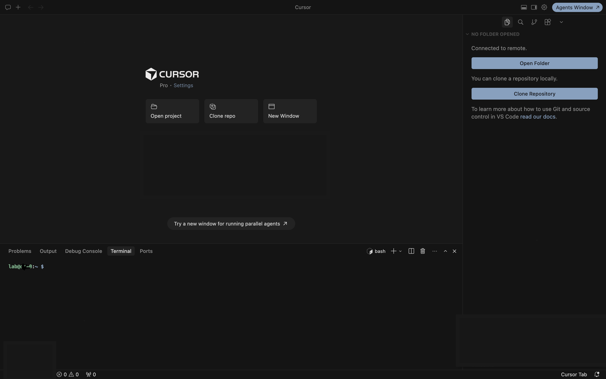
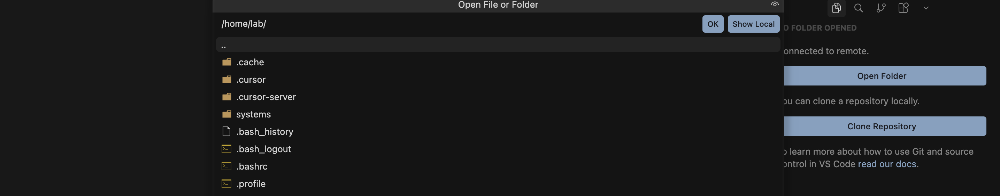
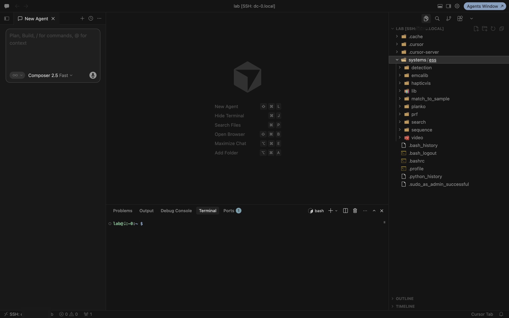
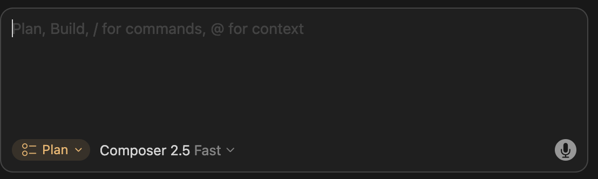
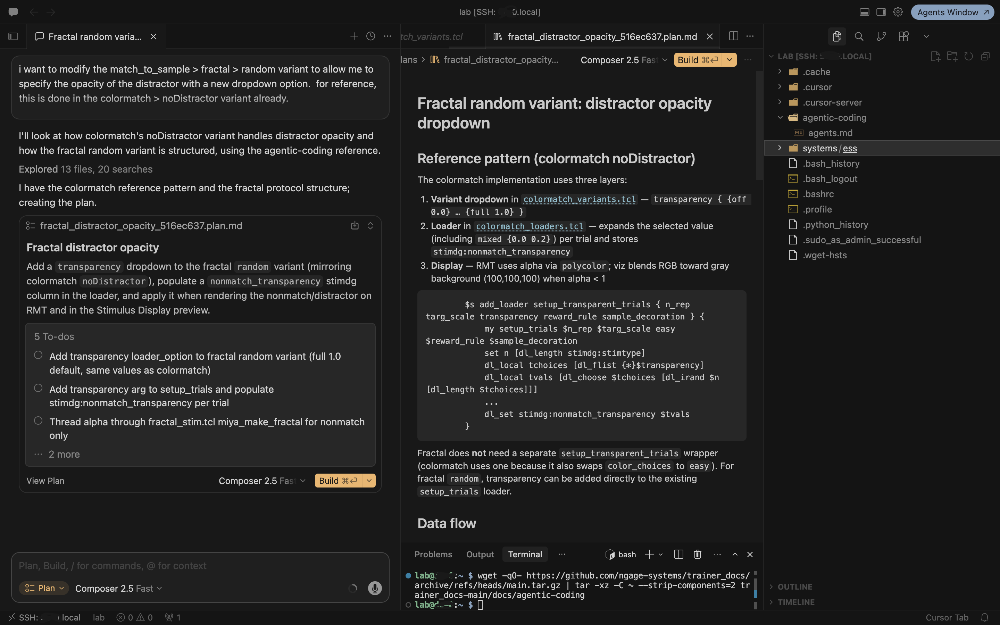
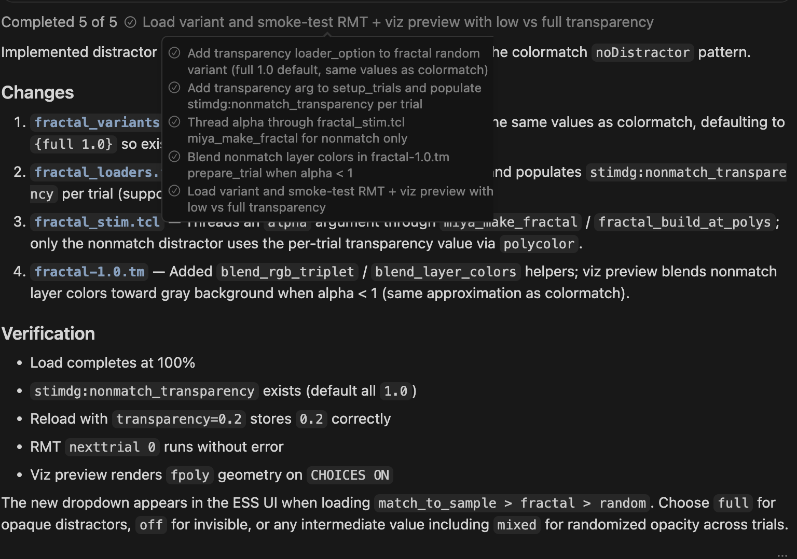

# Modifying protocols with agentic coding

These instructions explain how to use agentic coding to modify or create a task within an existing system. This workflow is **not** recommended for developing new systems (for example, Search or Match-to-sample from scratch). Use it when you want to create or modify tasks inside a system that already exists on the trainer.

This tutorial mainly uses **Cursor**, but **VS Code** works the same way for Remote SSH, editing files, and using the terminal. Where the steps mention Cursor-specific UI (for example, Ask, Plan, or Agent mode), the equivalent in VS Code is very similar.

## Preparation

1. Install [Cursor](https://cursor.com/) or [VS Code](https://code.visualstudio.com/). You may need a paid account with Cursor or one of the LLM providers if using VS Code.

2. Install **Remote - SSH** in Cursor or VS Code. Press `Cmd+Shift+X` (macOS) or `Ctrl+Shift+X` (Windows/Linux), search for **Remote - SSH** from `ms-vscode-remote`, and install it.

3. Connect to a trainer:
   - Press `Cmd+Shift+P` (macOS) or `Ctrl+Shift+P` (Windows/Linux).
   - Search for and select **Remote-SSH: Connect to Host**.
   - If the trainer you want is not listed, select **Add New SSH Host** and enter `lab@[ip-address-or-hostname]` (see [SSH into a device](ssh-into-device.md)).
   - After adding, Cmd/Ctrl+Shift+P and select the added device from the list.

   

4. The first connection may take about a minute to initialize. Enter the trainer password chosen during provisioning.

5. After connecting, Cursor or VS Code may install additional software on the trainer the first time. In the sidebar, click **Open Folder** and select `/home/lab`. You may be prompted for the password again.

   

6. A useful layout has four areas open: the main editor in the center, an agent panel on one side, the directory tree on the other, and a terminal at the bottom. The exact layout varies by Cursor or VS Code version.

7. In the directory tree, open `systems/ess`. Each subdirectory is a **system** on this trainer.

   

8. Download the agentic-coding reference folder. In the terminal, run:

   ```bash
   wget -qO- https://github.com/ngage-systems/trainer_docs/archive/refs/heads/main.tar.gz | tar -xz -C ~ --strip-components=2 trainer_docs-main/docs/agentic-coding
   ```

   This places the contents of that directory in your home folder (`~/agentic-coding`).

## Decide where to change (Ask mode)

9. In the agent panel, switch to **Ask** mode. Before planning or editing code, confirm **where** the change belongs: a new loader option on an existing variant, a new variant, or a new protocol. Many developers are unsure at first — use the agent to explore the codebase and recommend the smallest fit.

10. Describe what you want in plain language and ask the agent to recommend an approach. Point it at the reference docs:

    ```
    I want [describe the behavior you need — what the animal sees, what the experimenter should control, etc.].

    Which is the right level of change: (a) add a loader option to an existing variant, (b) add a new variant to an existing protocol, or (c) create a new protocol? Recommend one, name the closest existing protocol/variant to copy from, and list which files would need to change.

    Read ~/agentic-coding/agents.md — especially "Choosing where to make the change".
    ```

    Review the agent's answer. If you disagree or the goal is ambiguous, stay in **Ask** mode and refine until you agree on system, protocol, variant (if any), and change level.

## Plan and implement

11. Switch to **Plan** mode to develop and review a plan with the agent before implementing.

    

12. Tell the agent what you want to do. A good prompt covers four things:

    - **(a) Target** — which system, protocol, and variant you want to add or change (from the Ask-mode decision).
    - **(b) Change** — what you want added, removed, or modified (for example, a new dropdown option or a different default).
    - **(c) Reference** — any existing tasks that already do something similar, so the agent can follow the same pattern.
    - **(d) Context** — tell the agent to use the `~/agentic-coding` directory for how the trainer, ESS, and task code fit together.

    Example prompt (after Ask mode confirmed this is a loader option on an existing variant):

    ```
    I want to modify the match_to_sample > fractal > random variant to allow me to specify the opacity of the distractor with a new dropdown option.

    For reference, colormatch > noDistractor already exposes distractor opacity in a similar way — use that as a model.

    Reference ~/agentic-coding directory
    ```

    In that example: **(a)** is `match_to_sample > fractal > random`; **(b)** is a new dropdown for distractor opacity; **(c)** is `colormatch > noDistractor`; **(d)** is the last line. Include all four even if some seem obvious — the agent works much better with explicit scope and pointers.

13. When the agent finishes developing a plan (it may ask clarifying questions first), review the plan to confirm it understood your request. If something is wrong, stay in **Plan** mode and ask the agent to revise the plan.

14. When you are satisfied, click **Build** or switch to **Agent** mode and ask it to implement the plan.

    

15. The agent will likely request permission multiple times as it edits files and tests operation. Choose **Run** for each request.

16. When it finishes, it should summarize what it changed. Review the summary and confirm it stayed within the scope you defined.

    

## Testing and disseminating

17. If the task does not work as expected, switch to **Ask** mode, describe the problem, and have the agent explain its understanding of the issue and proposed fix. Then switch to **Agent** mode and ask it to implement the fix.

18. After confirming the task works, share the changes with other devices in your workgroup. The examples below use `match_to_sample` because that is the system changed in the example above — replace it with the name of the system you actually edited (the subdirectory under `systems/ess`, for example `search` or `colormatch`).

    ```bash
    cd ~/systems/ess/[system-name]/
    dservctl push -w [your-workgroup] [system-name] . --dry-run
    ```

    Example dry-run output (for the `match_to_sample` example):

    ```
    Would push 3 changed script(s):
      ↑ fractal/stim ← fractal/fractal_stim.tcl
      ↑ fractal/variants ← fractal/fractal_variants.tcl
      ↑ fractal/loaders ← fractal/fractal_loaders.tcl
    Unchanged: 15
    ```

    If the dry run looks correct, push the changes (again using your system name instead of `match_to_sample`):

    ```bash
    dservctl push -w [your-workgroup] [system-name] . -m "short description of your change"
    ```

    Example push output (for the `match_to_sample` example):

    ```
    Pushed 3, added 0, unchanged 15
    ```

    If a lib file was also changed, push that separately:

    ```bash
    cd ~/systems/ess
    dservctl libs push -w [your-workgroup] --dir ./lib -m "fractal viz transparency blend" --dry-run
    ```

    Example dry-run output:

    ```
    Would push 1 changed lib(s):
      ↑ fractal-1.0.tm (fractal v1.0)
    Unchanged: 8
    ```

    Then push:

    ```bash
    dservctl libs push -w [your-workgroup] --dir ./lib -m "fractal viz transparency blend"
    ```

    Example push output:

    ```
    Pushed 1, unchanged 8
    ```

19. On another trainer, pull the changes by clicking **Sync** in the top-right corner of **ESS Control**.

---

[← Modifying variant options](modify-variant-options.md) · [Documentation home](../README.md)
