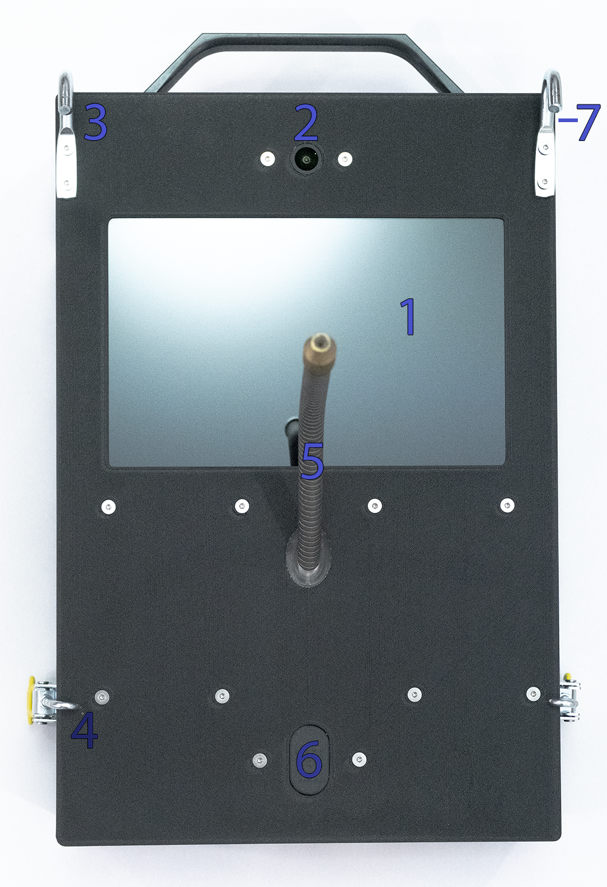
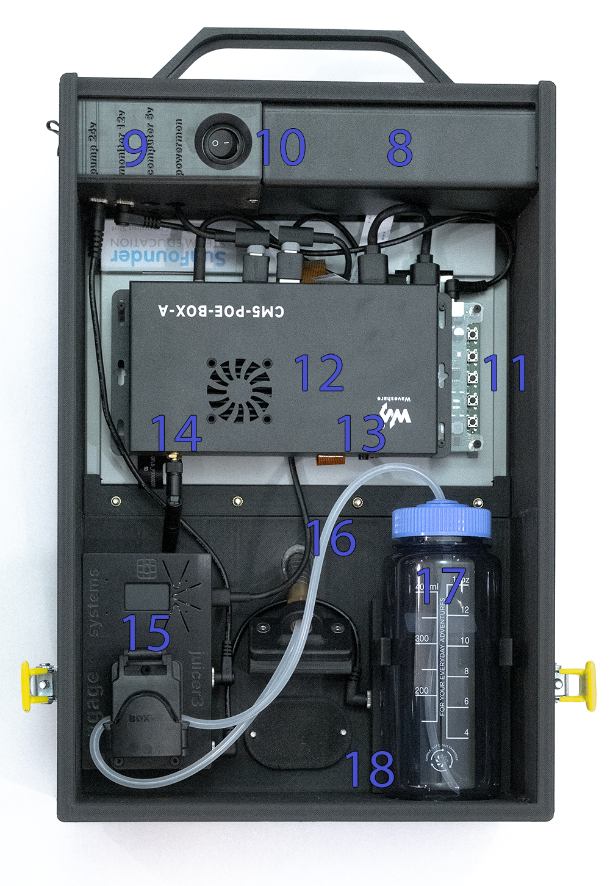

# Device overview and basic operation

## Get to know your device

### Front (typical layout)

1. Touchscreen monitor  
2. Camera  
3. Hooks  
4. Clamps  
5. Juice conduit  
6. Accessory port (can be used for buttons, joystick, etc.)  
7. 29.4 VDC charging port  

### Rear / internal access

<table>
<tr>
<td width="50%"></td>
<td width="50%"></td>
</tr>
</table>

8. Battery  
9. Power monitor  
10. System power switch  
11. Monitor controller  
12. Computer  
13. Computer power button  
14. Wi-Fi antenna  
15. Juicer  
   - 15.1 Display  
   - 15.2 Reward  
   - 15.3 Purge  
   - 15.4 Reset  
   - 15.5 Clamp  
16. Juice line  
17. Water bottle  
18. Smart bottle holder  

## Basic operation

1. Turn on the main power switch (10).  
2. Fill the water bottle (17) with the desired reward liquid and place it in the smart bottle holder (18).  
3. Feed the juice line (16) into the bottle so it reaches the bottom, then screw on the top.  
4. Use the **Purge** button (15.3) so the juice line fills and operates correctly (see [Using the Juicer](juicer.md)).  
5. Using a computer or tablet, [connect to the device](ess-control-quick-start.md), load the task, and confirm everything works before mounting.  
6. [Attach the trainer to the cage](cage-mounting.md) using the hooks (3) and clamps (4).  
7. Run tasks to collect data.  
8. Remove the trainer from the cage.  
9. Wipe down the trainer, especially the touchscreen (1).  
10. Rinse the bottle (17), fill with soapy water or an alkaline cleaner such as **Five Star PBW Liquid**, purge, then purge with clean water.  
11. Place the trainer on the charger.  

It is recommended to leave the trainer **charging and powered on** when not in use. If necessary to shutdown or reboot computer, press the power button (13) once and wait for it to shutdown. To cut power to the computer and monitor, flip the main switch (10) to off (note: 24V supply to Juicer pump remains active even when switch is off).

---

[← Documentation home](../README.md) · [Using the Juicer →](juicer.md)
