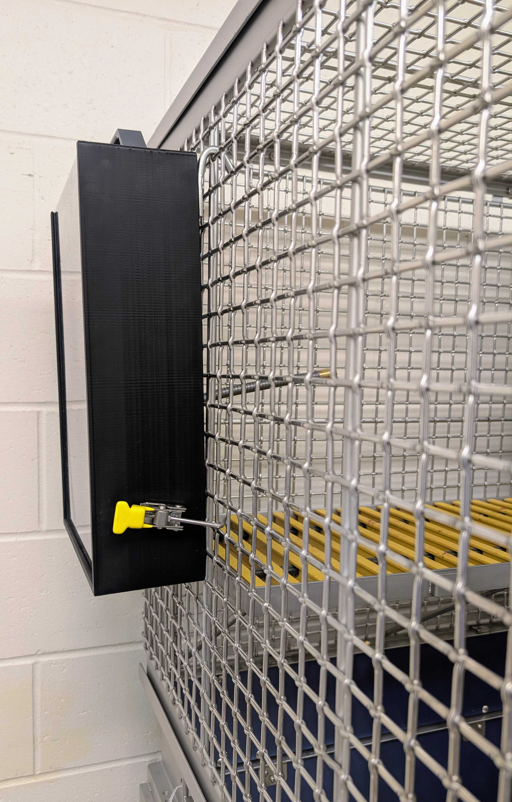

# Attaching to the cage

The default trainer layout fits many cage types. You need:

- A **flat** cage-wall area about the size of the trainer  
- **Mesh or fencing** with holes at least **20 × 20 mm**  
- A **perch or floor** inside where the subject can comfortably use the device  

The trainer uses **two hooks** near the top and **two clamps** near the bottom. Clamps adjust for different cages. Use an **8 mm** or **3/16"** wrench on the jam nut: loosen, set hook reach, then tighten.

## Steps

1. Lower the juice conduit so it is roughly **perpendicular** to the front of the trainer.  
2. Insert the juice conduit into the cage until the front of the trainer is **almost** touching the cage.  
3. Lift the trainer so the hooks reach the **highest practical row** of mesh and insert the hooks.  
4. Let the trainer settle, then tighten the clamps in place.  
5. Check placement from the subject’s perspective; re-mount if access is awkward.  
6. Adjust the bottom clamps so the trainer is **firmly secured**.  

---

[← Using the Juicer](juicer.md) · [Connecting to the device →](ess-control-quick-start.md)
