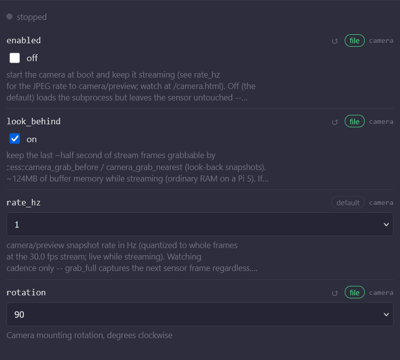
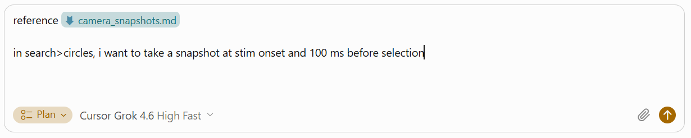

# Enable the trainer camera

The trainer has a built-in camera you can use to take photos during a task and embed them in the trial record. Install the camera software first, then put the camera agent docs on the trainer so coding agents can add snapshot support to tasks.

**The camera must only be used on a secure network that is not broadly accessible.** Do not enable it on an open, guest, or otherwise public network.

## 1. Install dserv Camera

Update **dlsh**, **dserv**, and **stim2** first so the trainer has current camera support. Follow [Update system software](update-system-software.md). Always update **dlsh** before **dserv** and **stim2** if those updates are available.

Then open the system software page in ESS Control. Click the **hostname** in the top bar (for example **rh-1**). Scroll down to **dserv Camera** and click **Install**.

If **dserv Camera** is not listed, close the browser window and open the system software page again. The install option can take a moment to appear after the other updates finish.

## 2. Put the camera agent docs on the trainer

Coding agents use a reference file to add camera snapshots to tasks. SSH into the trainer (see [SSH into a device](ssh-into-device.md)) and download it into `/home/lab/systems/agentic-coding`.

```bash
mkdir -p /home/lab/systems/agentic-coding
wget -O /home/lab/systems/agentic-coding/camera_snapshots.md https://raw.githubusercontent.com/SheinbergLab/dserv/main/docs/camera_snapshots.md
```

## 3. Enable the camera

In ESS Control, click **Settings** in the top right. On the left, choose **camera**. Check the box below "look_behind" and set rotation to 90. Close the dialog box.



## 4. Add snapshots to a task with a coding agent

Follow [Modifying protocols with agentic coding](agentic-modify-protocols.md). When you prompt the agent, tell it to use `/home/lab/systems/agentic-coding/camera_snapshots.md` and say when you want a photo. For example:



```
In search > circles, I want to take a photo when the subject selects the target.

Read /home/lab/systems/agentic-coding/camera_snapshots.md
```

```
In match_to_sample, I want to take a photo when the sample is presented.

Read /home/lab/systems/agentic-coding/camera_snapshots.md
```

```
In detection, I want to take a photo when the oddball is presented and 100 ms before the subject responds.

Read /home/lab/systems/agentic-coding/camera_snapshots.md
```

## 5. Collect a data file

Photos are saved in the trial data file. Follow [Create a data file](create-data-file.md) to open a file, run the task, and download it.

In **Data Manager**, the file should show status **ok**. Status **obs_only** means post-processing of the data file failed. Tell the coding agent to fix it.

Open and read the file as described in [Create a data file](create-data-file.md). Camera times are in `cam_request_t` and `cam_capture_t` (ms from obs start; capture `-1` means no frame).

Images are in `cam_jpeg`. Each trial is one or more JPEG byte arrays. Write them out like this:

```python
from pathlib import Path

raw = np.asarray(frame, dtype=np.uint8).tobytes()
Path(f"trial_{i:03d}_{k}.jpg").write_bytes(raw)
```

Real JPEGs start with `FF D8` and are about 200 KB. Empty bytes and `cam_capture_t == -1` means the grab failed.

---

[← Update system software](update-system-software.md) · [Install an I/O box →](install-iobox.md)
