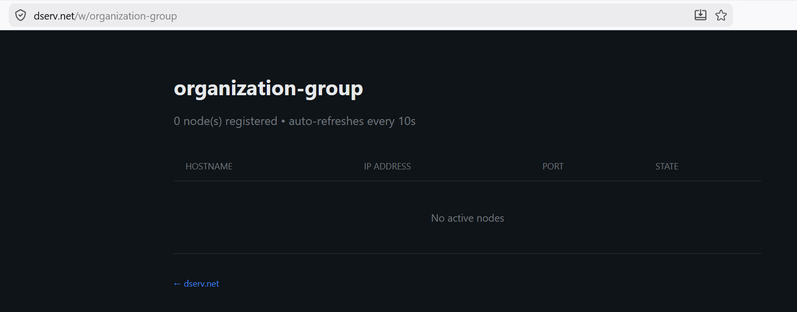
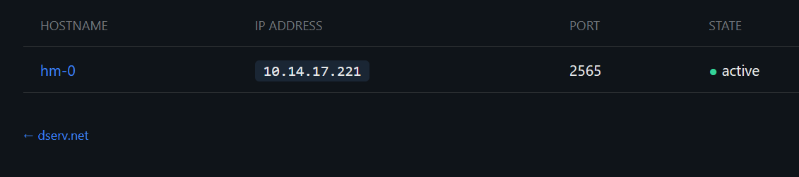
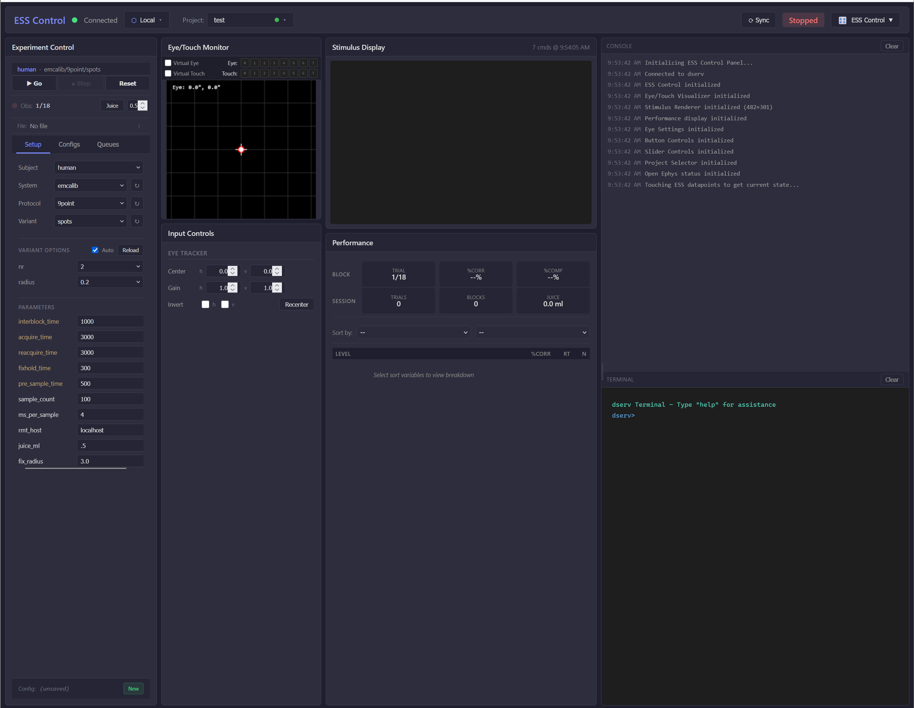
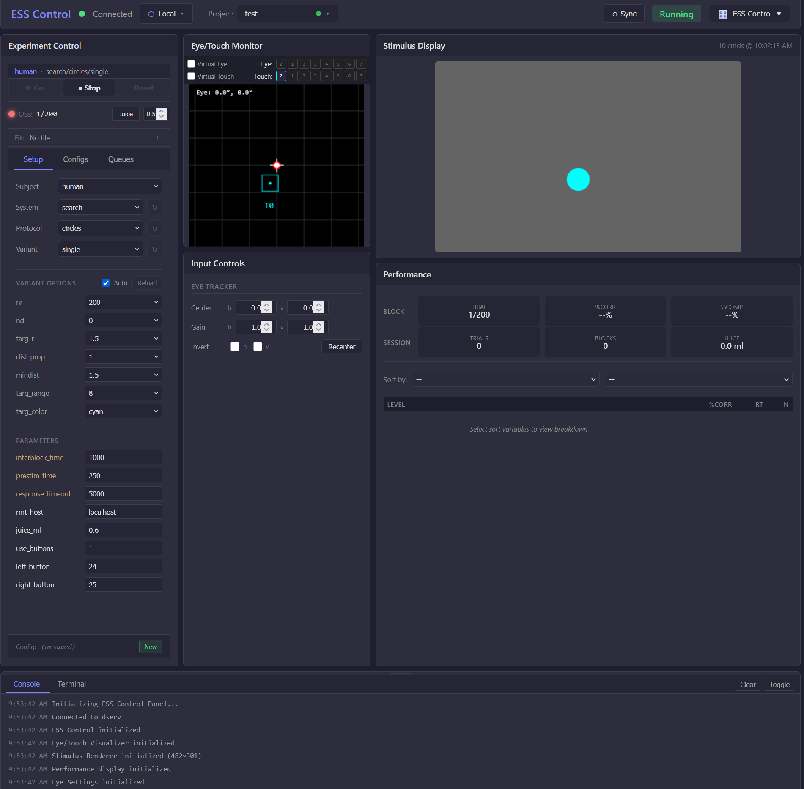

# Connecting to the device and quick test

## Open your workgroup page

Browse to:

`https://dserv.net/w/[workgroup-name-supplied-with-device]`

After provisioning and reboot, the device should appear within about **60 seconds** if Wi-Fi connected successfully.

The first boot after provisioning may show a login screen on the trainer. That is expected; you do not need to log in. Load a task such as **Search** below, and **stim2** should take over the screen.

## Open ESS Control

Click the **hostname** of the device you want to control. It may take a minute to fully connect on first boot.

## Run a quick Search trial

1. In the left **Experiment Control** pane, choose a **System** from the dropdown (for example **Search**).  
2. Click **Go** near the top of the pane.  
3. The **Stimulus Display** pane should show a **blue circle**, also visible on the device touchscreen.

4. Tap the circle on the touchscreen. You should hear the Juicer run; the **Performance** pane should show trial completion.  
5. Click **Stop** in **Experiment Control**.  

---

[← Attaching to the cage](cage-mounting.md) · [SSH into a device →](ssh-into-device.md)
