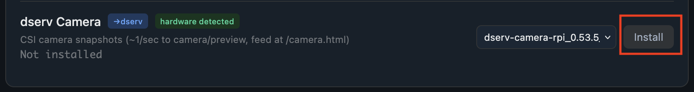
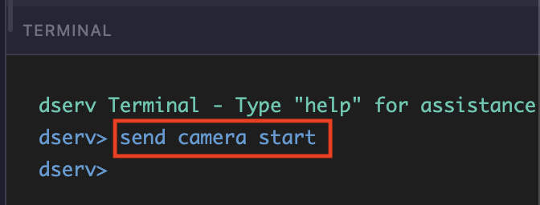
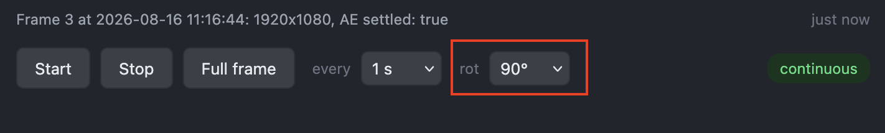

# Install camera support

Enable the trainer camera so ESS Control can show a live preview at `/camera.html`.

## 1. Update system software

Update **dlsh**, **dserv**, and **stim2** first so the trainer has current software and the camera package is available. Follow [Update system software](update-system-software.md). Always update **dlsh** before **dserv** and **stim2** if those updates are available.

## 2. Open the device page

Open ESS Control for the trainer (see [Connecting to the device](ess-control-quick-start.md)). In the top toolbar, click the **hostname** (for example **rh-1**).


## 3. Install the camera

On the device software page, find **dserv Camera**. It should show **hardware detected** and **Not installed**. Click **Install**.



## 4. Start the camera

Return to **ESS Control**. In the **TERMINAL** pane, enter:

```
send camera start
```



## 5. Open the camera page

In the same URL as ESS Control, replace `ess_control` with `camera`.

For example, if ESS Control is:

`http://192.168.0.51:2565/ess_control.html`

browse to:

`http://192.168.0.51:2565/camera.html`

## 6. Rotate the preview

If the image is sideways, set **rot** to **90°**.



---

[← Modifying variant options](modify-variant-options.md) · [Documentation home](../README.md)
