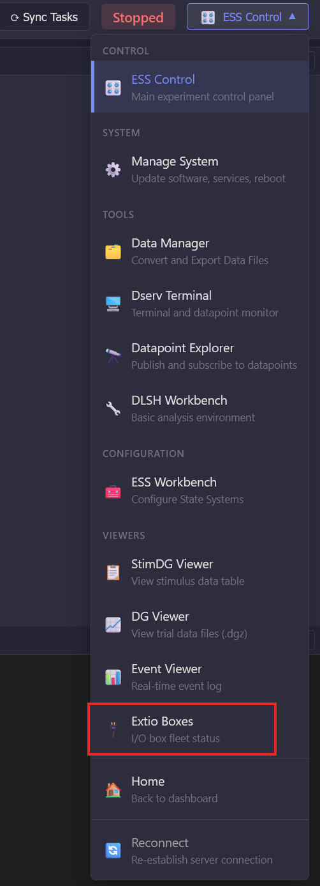
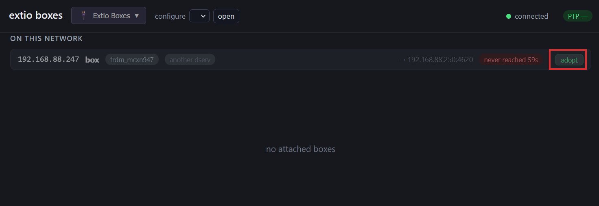
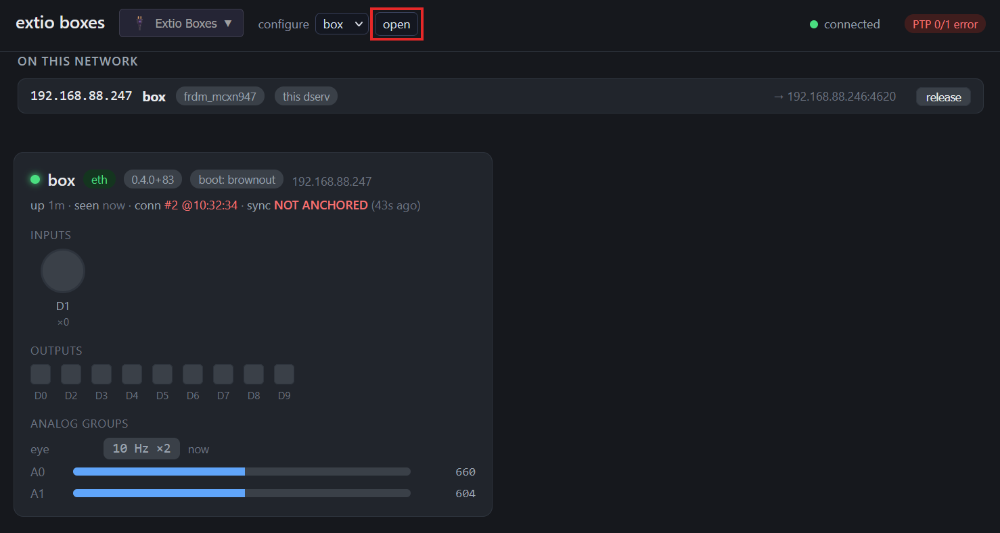
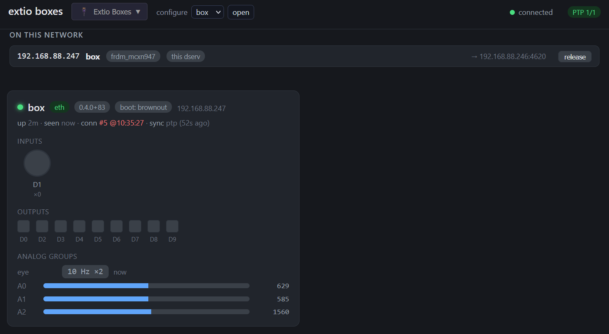
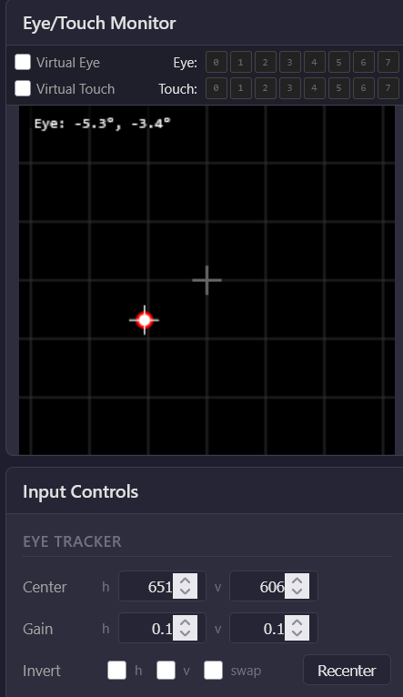

# Install an I/O box

Connect an I/O box to a trainer for digital and analog I/O such as eye tracking. First prepare the host device (usually a trainer) as the PTP grandmaster on Ethernet. Then adopt the I/O box in ESS Control and save the connection to flash.

## Prepare the host

### 1. Update system software

Update **dlsh**, **dserv**, amd **stim2** first so the trainer has current PTP support. Follow [Update system software](update-system-software.md). Always update **dlsh** before **dserv** and **stim2** if those updates are available.

### 2. SSH into the trainer

Connect over SSH. See [SSH into a device](ssh-into-device.md).

### 3. Configure the trainer as PTP grandmaster

On the trainer, run:

```bash
curl -sSL https://dserv.net/setup?profile=incage | bash -s -- --time-role "grandmaster eth0"
sudo apt install chrony
sudo cp /usr/local/dserv/systemd/chrony-grandmaster.conf /etc/chrony/conf.d/10-dserv-grandmaster.conf
```

The setup script installs current software and configures the trainer as the PTP grandmaster on `eth0`. Then install chrony and copy the grandmaster config into place.

## Adopt the I/O box

### 1. Connect the I/O box

Plug USB-C power (either port on the I/O box works for this purpose) and Ethernet into the I/O box. Plug the other end of the Ethernet cable into the same switch or router the trainer is connected to. 

### 2. Open Extio Boxes

Open ESS Control for the trainer (see [Connecting to the device](ess-control-quick-start.md)). In the top right, click the **ESS Control** dropdown and select **Extio Boxes**.



### 3. Adopt the box

The I/O box should appear under **ON THIS NETWORK** and after about 30 seconds an "adopt" option should appear. Click **adopt**.



### 4. Open the box configuration

Within a few seconds, a card should appear for the new box. Click **open** near the top of this window to open the device configuration page.



### 5. Save to flash

At the top of the page, it should notify you that changes were made. Scroll down to the bottom and click **Save to flash** so the box remembers this connection after reboot.


### 6. Confirm the box is active

Within about 30-60 seconds, the box should show as connected with (`sync ptp`). It may take up to two minutes to properly sync the clocks of the trainer and I/O box. Inputs, outputs, and analog groups (including **eye**) should update live.



### 7. Check eye position

Return to **ESS Control**. The **Eye/Touch Monitor** should show live eye coordinates. Use **Recenter**, **Center**, **Gain**, and **Invert** as needed. Note: when using analog inputs for eye position, the gain settings will likely be quite low (~0.01).



## Troubleshooting

If the box adopts but never shows (`sync ptp`), or sync appears and then drops, the wired path between the trainer and the I/O box is the usual cause. PTP needs Ethernet between the trainer's Ethernet port and the I/O box. It will not sync over Wi-Fi.

Many consumer and campus switches filter or delay the multicast traffic PTP uses. Put both devices on an unmanaged gigabit switch, or use two LAN ports on the same router. Avoid guest networks, and turn off IGMP snooping if that setting exists.

On a campus or managed network, ask IT to allow PTP multicast (UDP ports 319 and 320) on that VLAN, or use a PTP-aware (IEEE 1588) switch.

---

[← Update system software](update-system-software.md) · [Enable offline mode →](enable-offline-mode.md)
