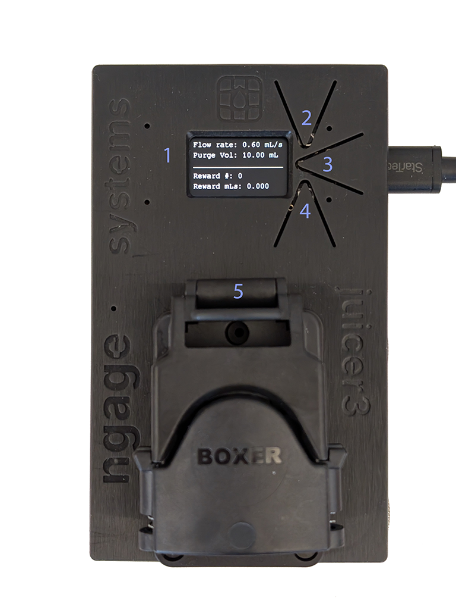

# Using the Juicer



## Basic operation

The display (1) indicates the active modes and accumulated stats since last reset:

- **Reward** (2) — Runs the pump while you hold the button.  
- **Purge** (3) — Runs long enough to deliver the configured amount of liquid.  
- **Reset** (4) — Resets the counters.  


## Replacing the juice line

Use dish soap daily and an alkaline cleaner (for example **Five Star PBW Liquid**) weekly to keep the line clean. Replace the line when needed.

### Parts required

- At least **1 m** of tubing (silicone, **5 mm OD**, **3 mm ID**)  
- **3.5 mm** hex key  
- Replacement nozzle  
- Scissors  

### Steps

1. Lift the clamp (labeled '5' in the image above) on the Juicer pump and remove the juice line from the pump.  
2. Use a **3.5 mm** hex key to unscrew the nozzle from the tip of the juice conduit (TODO: `nozzle-with-hex-key.png`).  
3. Separate the nozzle barbed fitting from the juice line.  
4. Pull the old juice line through the conduit.  
5. Use the old line as a reference to cut the new line to length.  
6. Insert the new line through the conduit.  
7. Push the barbed fitting of the new nozzle into the juice line.  
8. Screw the new nozzle into the tip of the juice conduit. Allow the full juice line to rotate with the nozzle so it does not coil until the nozzle sits slightly recessed into the conduit tip.  
9. Insert the new line into the pump in the correct direction: from the conduit into the **left** side of the pump, exiting to the **right** into the bottle.  
10. Depress the pump clamp to lock it.  
11. Press **Reward** on the Juicer to verify operation.  

## Calibrating

### Method 1 — 0.1 g precision scale (preferred, &lt;1% error)

1. Put at least **100 mL** water in the bottle, insert the juice line, and screw on the lid.  
2. Purge at least **10 mL** so the line is full of water.  
3. Place a vessel on the scale under the juice conduit spout.  
4. Purge **20 mL** or more (more improves accuracy) into the vessel.  
5. If the scale reads below **19.8 g** or above **20.2 g** for a 20 mL nominal purge, adjust flow rate — see [Adjust flow rate](#adjust-flow-rate).  

### Method 2 — Included water bottle (~5–10% error)

1. Fill the bottle to slightly above the **300 mL** mark, insert the juice line, and screw on the lid.  
2. Hold **Reward** until the line is filled and the level is right at **300 mL**.  
3. Use **Purge** repeatedly to remove at least **100 mL** (preferably **200 mL**) into a sink or vessel.  
4. Read the remaining volume from the bottle markings and subtract from **300 mL**.  
5. If the removed volume differs unacceptably from what the Juicer intended, see [Adjust flow rate](#adjust-flow-rate).  

### Adjust flow rate

1. In **ESS Control**, open the **Terminal** window in the bottom pane.  
2. Paste the command below. Replace `expected_mls` and `actual_mls` with your measured values:

```text
send juicer {$::juicer do_cmd {{"set": {"adjust_flow_rate": {"expected_mls": 20.0, "actual_mls": 20.8}}}}}
```

3. The reply should show the old and new `flow_rate` settings; the Juicer display should reflect the new value.

---

[← Basic operation](basic-operation.md) · [Attaching to the cage →](cage-mounting.md)
