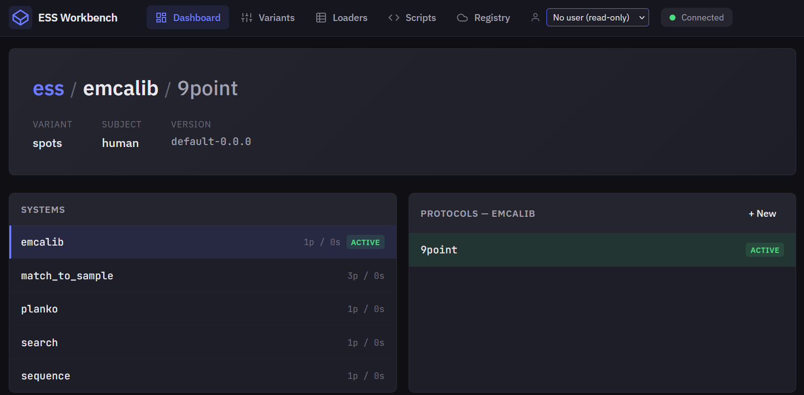
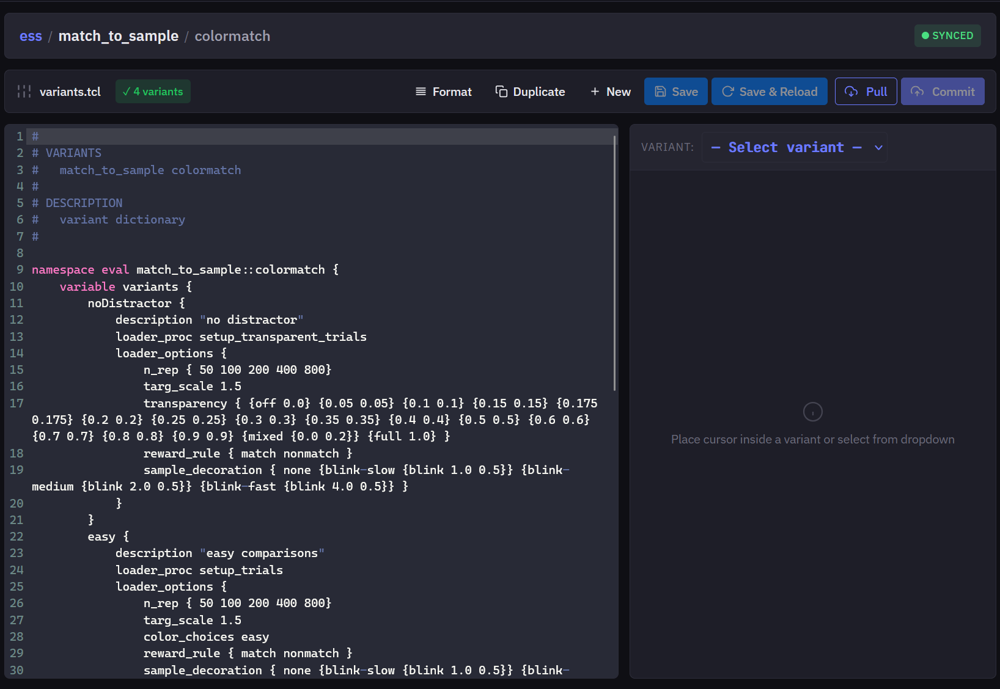
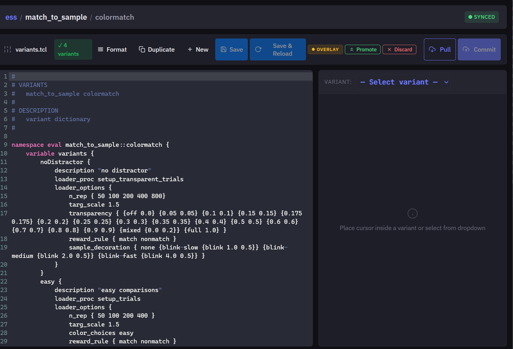

# Modifying variant options

Use ESS Workbench to change the dropdown options available for a task variant.

## Steps

1. Open ESS Workbench:

   - Go directly to `http://[trainer-ip]:2565/ess_workbench.html`, or
   - From **ESS Control**, click the menu in the top-right corner and select **ESS Workbench**.

   To find the trainer IP, open your workgroup page at `https://dserv.net/w/[workgroup-name]` (see [Connecting to the device](ess-control-quick-start.md)).

   

2. In the top-right, select your username.

3. Under **Systems**, select the state system you want to edit.

4. Under **Protocols**, select the protocol you want to edit.

5. At the top, click the **Variants** tab.

   

6. On the right, select the variant you want to edit.

7. The editor will:

   - **Left panel** — jump to the code section for that variant.
   - **Right panel** — show the dropdowns as they will appear to the user, updating as you edit.

8. Add or remove options in the code editor on the left. The panel on the right shows warnings if the syntax is invalid.

9. When you are ready to test, click **Save & Reload**. Return to **ESS Control**, open the task, and confirm the dropdown menus reflect your changes. Select the new options and run the task to verify they work.

   

10. After confirming the changes work, return to ESS Workbench and click **Promote**. This makes your version the only copy of that task on the trainer you are connected to; changes are not yet on the server.

11. Click **Commit** to push your changes to the server.

12. On any other trainer in your workgroup, click **Sync** in the top-right of **ESS Control** to pull those changes.

---

[← Connecting to the device](ess-control-quick-start.md) · [Documentation home](../README.md)
