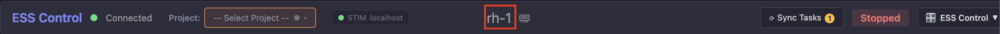

# Update system software (dserv / stim2 / dlsh)

Install available updates for **dserv**, **stim2**, and **dlsh** on a trainer.

## Click the hostname

In ESS Control, click the **hostname** in the top bar (for example **rh-1**).

That opens the system software management page.

If you cannot click the hostname, the trainer is on older software. Follow the method below instead.

## Older software: open Lab Mesh by IP

### 1. Find the device IP

Open your workgroup page on [dserv.net](https://dserv.net) (see [Connecting to the device](ess-control-quick-start.md)). Note the IP address of the device you want to update.

### 2. Open Lab Mesh

In the browser, go to that IP **without** the port.

For example, if the dserv.net link opens:

`http://192.168.0.10:2565`

browse to:

`http://192.168.0.10`

That page is the **Lab Mesh** directory. It lists all devices on your mesh.

### 3. Open the update panel

Find the device you want to update. On the right, click the **gear** icon to open the side panel.

The panel lists software components (**dserv**, **stim2**, **dlsh**). Components with an available update show a blue **Update** button.

## Apply updates

If updates exist, apply them in this order: **dlsh**, then **dserv**, then **stim2**. Skip any component that does not have an update.

---

[← Enable cloud trial upload](enable-cloud.md) · [Install an I/O box →](install-iobox.md)
